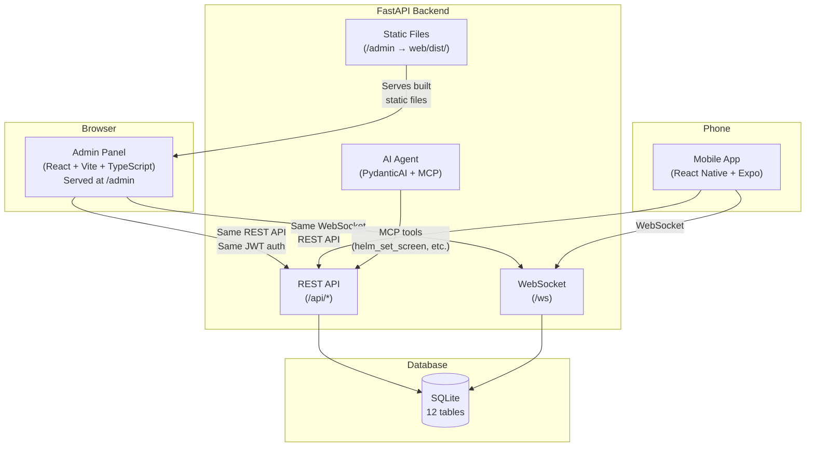
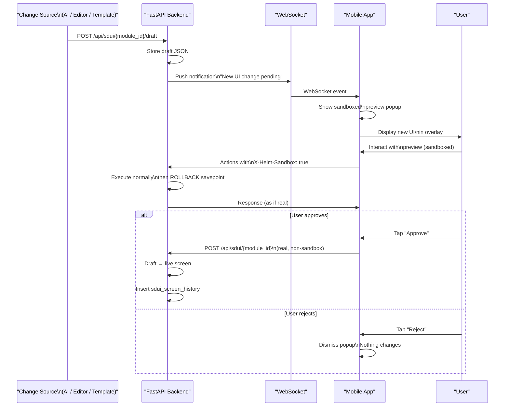

# Architecture Decisions — Session 6 (2026-04-05)

## Project Context (for standalone readers)

**Helm** is a self-hosted SDUI (Server-Driven UI) platform with AI-assisted editing. It has three layers:

1. **Backend** — Python FastAPI server with PydanticAI agent, MCP over StreamableHTTP, SQLAlchemy + SQLite. Handles API gateway, AI agent runtime, action registry, workflow engine.
2. **Protocol** — WebSocket for real-time push, REST API for CRUD, MCP for agent tool calls.
3. **Mobile App** — React Native (Expo), iOS-first. SDUI renderer that maps JSON payloads → native components. Developed on Linux; Mac only for final App Store build.

**Layout system (locked):** Row-by-Row containers (industry standard — Airbnb, Shopify, Netflix, Spotify, Uber all use this). Page = vertical stack of Rows → each Row = horizontal band with N Cells → each Cell = one component.

**Component catalog (two tiers):**

- **Atomic components** (7): Text, Markdown, Button, Image, TextInput, Icon, Divider — simple, stateless, configurable via props. No internal logic beyond rendering.
- **Hardcoded components** (4): CalendarModule, ChatModule, NotesModule, InputBar — complex, self-contained React Native modules with their OWN internal state, data fetching, event handling, and navigation. They are NOT atomic. The client sees `{type: "calendar"}` and renders a full, opinionated, internally-managed Calendar module. You cannot decompose, rearrange, or customize their internal layout from the server.

Additionally, **structural components** (Container, Row, Column, ScrollView, Spacer) exist for internal dev use only — they are NOT exposed to the AI or the visual editor.

**Existing backend API surface (before this session):** 9 routers, 9 DB tables, 22 MCP tools, 8 action registry handlers. Auth, Calendar CRUD, Chat (WebSocket), Notifications, SDUI screens (get/set/delete/list/draft/approve/reject), Agent Config, Workflows (CRUD + APScheduler), Actions (execute with whitelist registry), Health check.

---

## Session 6 — Backend UI: Admin Panel API & Visual Editor

This page captures ALL architecture decisions from the Session 6 brainstorming (2026-04-05). It is **self-contained** — no other document is needed to understand and implement everything described here.

**Scope:** Missing API endpoints, backend modernization, admin panel architecture, visual editor (using Puck), sandboxed preview system, component terminology clarification, and open-source library stack.

---

## 1. Key Decisions Summary

1. **Admin panel architecture: Option A — Separate React web app served by FastAPI.** A new `web/` directory at repo root (alongside `backend/`, `mobile/`, `agent/`). Built with Vite + React + TypeScript. FastAPI mounts the built static files at `/admin` via `app.mount("/admin", StaticFiles(...))`. Shares the exact same REST API, WebSocket, and auth tokens as the mobile app. **Rejected alternatives:** Jinja2/HTMX server-rendered (too limited for drag-and-drop interactivity), embedded in mobile app (admin on phone is bad UX, and keeping it web-only keeps Apple ToS cleaner).
2. **Macro Expansion — CANCELLED for MVP.** Calendar, Chat, Notes, InputBar stay as **hardcoded components**. No `macro_expander.py`, no data bindings, no repeaters, no data connectors. These are complex atomic components with their own internal state and data fetching. There is no point decomposing "April 5th is a Sunday" into atomic JSON — that's the calendar's job. If we ever want to decompose hardcoded components into atomic trees, that's a V2 architecture overhaul.
3. **Component Registry: Database table** (`component_registry`) with `props_schema` (JSON Schema for visual editor + validation), `default_props` (defaults when dragged onto canvas), CRUD API. NOT a static JSON file — DB table allows runtime additions without redeploying. No `expansion_template` column (macro expansion cancelled).
4. **Sub-modules via navigate action.** New `module_states.parent_module_id` column, new `navigate` action type, nav stack pattern (push/pop like iOS navigation). **Low priority — skip if tight on time.** Use cases: settings module, detail views, multi-step flows.
5. **Sandboxed Preview: Unified draft flow.** ALL screen changes (from AI `helm_set_screen`, from visual editor save, from template apply) go through the same path: draft → sandboxed popup preview on mobile → approve/reject. Backend uses SQLAlchemy savepoint rollback. Auto-approve toggle per module for rapid prototyping.
6. **Screen History: Unlimited/1yr retention + starring.** `sdui_screen_history` table with `is_starred` column. Every screen change (any source) inserts a row. Enables: full undo/redo across sessions, "who changed this screen and when?", rollback to any version, analytics on AI vs human edits.
7. **MCP component registration: Static for now.** Defer runtime AI registration of new component types due to lost-in-the-middle concerns with too many MCP tool descriptions.
8. **Visual Editor: Use Puck (MIT license, 12.5k GitHub stars).** Open-source drag-and-drop page builder for React. Puck is NOT a competitor to Helm — it is a tool/framework we use INSIDE Helm's admin panel. Puck handles DnD mechanics, property inspector, undo/redo. We do NOT use Puck's cloud AI feature (we have our own PydanticAI agent). Replaces ~60-70% of custom editor work.
9. **Open-source stack — trimmed for vibe coding.** Day-1 essentials only: Puck, shadcn/ui, React Router, Zustand. Everything else added incrementally when the specific phase needs it. Don't overwhelm the vibe code agent.
10. **Screen size MVP:** Design for ~390px (most common iPhone width), percentage-based sizing, width preview slider in editor. Defer true responsive breakpoints. The visual editor is for **small tweaks by beginners** — must be beginner-friendly: no code visible by default, tooltips everywhere, sensible defaults.
11. **Puck preview fidelity: Mobile-accurate.** The editor renders components exactly as they'd look on the phone. Hardcoded components (Calendar, Chat, Notes) show filler/placeholder text for data-dependent content (mock events, mock messages, mock notes).
12. **Data binding expressions — CANCELLED.** No `data.calendar.events` template expressions. Components handle their own data fetching internally. This simplifies the client renderer significantly.
13. **Puck compatibility: Translation layer needed.** Puck outputs its own JSON format (flat `content[]` array with `zones`), which ≠ Helm's SDUI JSON (`rows[] → cells[] → component`). Need a bidirectional adapter: `puckToHelm(puckData)` converts Puck output → Helm SDUI format, `helmToPuck(helmJson)` converts Helm SDUI → Puck format for loading existing screens. ~50-100 lines of mapping code. Also need to configure Puck's zone/slot system to enforce our Row → Cell → Component structure. Net savings: ~5-7 hours vs building all DnD from scratch.
14. **Component terminology: Two tiers (CRITICAL — use correct terms).** (a) **Atomic components:** Text, Button, Image, TextInput, Icon, Divider — simple, stateless, configurable via props, no internal logic. (b) **Hardcoded components:** Calendar, Chat, Notes, InputBar — complex, self-contained, own internal state/data fetching/logic. **Hardcoded ≠ atomic.** Never call Calendar "atomic" or "complex atomic." They are completely different tiers.

---

## 2. Backend API Assessment

### 2.1 Existing API — Solid & Ready for Admin UI

| System | Status | Details |
| --- | --- | --- |
| **SDUI** | ✅ Ready | Full get/set/delete/list screens, draft/approve/reject workflow, tab hide/show/rename. This is the backbone the visual editor consumes. |
| **Calendar** | ✅ Ready | Full CRUD + auto SDUI refresh after changes. |
| **Actions** | ✅ Ready | Clean `POST /api/actions/execute` with whitelist registry. 8 registered action handlers. |
| **Workflows** | ✅ Ready | Full CRUD + APScheduler integration. One caveat: `fire_trigger()` is dead code (see Modernization). |
| **Agent Config** | ✅ Ready | Get/update with Fernet encryption for API keys. |
| **Auth** | ✅ Ready | Setup (first user creation), login, logout, refresh, device tracking. JWT-based. |
| **Notifications** | ✅ Ready | List, mark read, mark all read. |
| **Chat** | ✅ Ready | WebSocket real-time messaging + REST history endpoint. |
| **Health** | ✅ Ready | Basic health check endpoint. |

### 2.2 Missing API Endpoints (Must Build Before Admin Panel)

1. **No user management API.** `POST /auth/setup` creates the first user, `manage.py` CLI creates more, but there is NO `GET /api/users`, `POST /api/users`, `DELETE /api/users/{id}`, `PUT /api/users/{id}/role`. An admin panel without user CRUD is dead on arrival.
2. **No session management API.** Cannot list active sessions, see connected devices, or revoke sessions remotely. Admin needs `GET /api/sessions`, `DELETE /api/sessions/{id}`.
3. **No analytics/metrics endpoints.** Zero visibility into system health. Need: active WebSocket connections count, total users, workflow run history/logs, MCP tool call logs.
4. **No SDUI template management.** Session 4 decided templates are dual-purpose (few-shot AI examples + token-saving shortcuts), but there is no `GET/POST/DELETE /api/templates` to save, load, share, or browse template JSON. The visual editor needs this as its core CRUD.
5. **No audit log.** No tracking of who changed what screen, who approved which draft, when workflows ran and what they did.

### 2.3 Needs Modernization

1. **`fire_trigger()` is completely dead.** The function exists in `workflow_engine.py` but NO router ever calls it. Event-driven workflows (`EVENT_CREATED`, `EVENT_UPDATED`, `MESSAGE_RECEIVED`) are dead code. Must wire before admin panel shows workflow dashboards.
2. **Pagination/filtering gaps.** Workflows return ALL rows with no pagination. Notifications have `limit` but no cursor/offset. Chat has offset but no search. Admin panels need consistent pagination across all list endpoints.
3. **No bulk operations.** Cannot bulk delete notifications, events, or workflows. Admin panels need these.
4. **Logout doesn't invalidate server session.** Known bug. Backend `POST /auth/logout` already works and sets `is_active=False`. The mobile app's `logout()` in `authStore.ts` just clears local state without calling the API. One-line fix.

---

## 3. New API Endpoints — Full Specification

### 3.1 `require_admin` Dependency (Foundation)

Before any new endpoints, create a `require_admin` dependency in `dependencies.py`:

```python
async def require_admin(current_user = Depends(get_current_user)):
    if current_user.role != "admin":
        raise HTTPException(status_code=403, detail="Admin access required")
    return current_user
```

This gates all admin-only endpoints. Regular users get 403.

### 3.2 User Management — `routers/users.py`

**Why:** Admin panel cannot function without user CRUD. Currently users can only be created via CLI (`python manage.py create_user`). The admin panel needs to create, list, update, and delete users through the API.

**Existing table used:** `users` (already has `id, username, password_hash, role (admin/user)`).

| Method | Path | Auth | Description |
| --- | --- | --- | --- |
| `GET` | `/api/users` | admin | List all users (paginated via `PaginationParams`). Returns `id, username, role, created_at` for each user. **Never returns password hashes.** Supports search by username. |
| `POST` | `/api/users` | admin | Create a new user. Body: `{username: str, password: str, role?: "admin" | "user"}`. Role defaults to `"user"`. Hashes password with bcrypt before storing. Replaces the CLI-only `manage.py` workflow. |
| `GET` | `/api/users/{id}` | admin | Get single user's full details including aggregate counts: device_count (from `devices` table), active_session_count (from `sessions` table where `is_active=True`), workflow_count (from `workflows` table), module_count (from `module_states` table). |
| `PUT` | `/api/users/{id}` | admin | Update user. Body: `{username?: str, password?: str, role?: str}`. **Safety constraint:** Cannot demote yourself from admin (prevents locking yourself out). If password is provided, re-hash with bcrypt. |
| `DELETE` | `/api/users/{id}` | admin | Delete user + **cascade delete** all associated data: sessions, devices, agent configs, calendar events, notifications, workflows, module_states, chat messages. **Safety constraint:** Cannot delete yourself. |

**Files to create/edit:** `routers/users.py` (new), `schemas/users.py` (new — `UserOut`, `UserCreate`, `UserUpdate`, `UserDetailOut`), `dependencies.py` (add `require_admin`), `main.py` (register router).

### 3.3 Session Management — `routers/sessions.py`

**Why:** Admins need to see who's logged in, from what devices, and revoke sessions remotely. Users need to see their own sessions and log out everywhere else.

**Existing tables used:** `sessions` (has `id, user_id, token, is_active, created_at`) and `devices` (has `id, user_id, device_name, device_id`).

| Method | Path | Auth | Description |
| --- | --- | --- | --- |
| `GET` | `/api/sessions` | admin | List ALL active sessions across all users. Joins with `devices` table to include `device_name, device_id` per session. Paginated. Used by admin dashboard to show "Who's connected right now?" |
| `GET` | `/api/sessions/me` | user | List the current user's own active sessions + associated device info. Answers "Where am I logged in?" for the user. |
| `DELETE` | `/api/sessions/{id}` | user/admin | Revoke (invalidate) a specific session by setting `is_active=False`. **Permission:** Regular users can only revoke their OWN sessions. Admins can revoke ANY session. |
| `DELETE` | `/api/sessions/me/others` | user | Revoke ALL of the current user's sessions EXCEPT the one making this request. "Log me out everywhere else." Identifies current session from the auth token. |

**Files to create/edit:** `routers/sessions.py` (new), `schemas/sessions.py` (new — `SessionOut` with joined device info), `main.py`.

### 3.4 SDUI Template Management — `routers/templates.py`

**Why:** Templates are the core of the visual editor's content library. Users save screen layouts as reusable templates, browse a template library, and apply templates to modules. Templates are also the mechanism for row-level drag-and-drop composition (see Visual Editor section).

**New table — `sdui_templates`:**

```
sdui_templates:
  id          UUID PK default uuid4()
  name        str NOT NULL (unique per user, or globally unique for public templates)
  description str NULLABLE
  category    str NOT NULL (one of: "dashboard", "planner", "tracker", "form", "custom")
  screen_json JSON NOT NULL (exact same shape as helm_set_screen output — contains rows[], each row has cells[], each cell has a component)
  created_by  UUID FK → users.id NOT NULL
  is_public   bool DEFAULT false (if true, visible to ALL users; if false, only visible to creator)
  created_at  datetime DEFAULT utcnow()
  updated_at  datetime DEFAULT utcnow() ON UPDATE utcnow()
```

| Method | Path | Auth | Description |
| --- | --- | --- | --- |
| `GET` | `/api/templates` | user | List templates visible to the current user (own private + all public). Supports `?category=dashboard` filter, `?search=name` text search, pagination. Returns `id, name, description, category, is_public, created_by, created_at` (NOT full screen_json — that's heavy). |
| `POST` | `/api/templates` | user | Save a new template. Body: `{name, description?, category, screen_json, is_public?}`. The `screen_json` is the full SDUI payload (same shape as what `helm_set_screen` produces). Sets `created_by` to current user. |
| `GET` | `/api/templates/{id}` | user | Get a single template's full data INCLUDING `screen_json`. Only accessible if the template is public OR owned by the current user. |
| `PUT` | `/api/templates/{id}` | user | Update a template's metadata or content. Body: `{name?, description?, category?, screen_json?, is_public?}`. **Permission:** Only the owner can update, OR an admin. |
| `DELETE` | `/api/templates/{id}` | user | Delete a template. **Permission:** Only the owner can delete, OR an admin. |
| `POST` | `/api/templates/{id}/apply` | user | Apply a template to a module. Body: `{module_id: str}`. This creates a **draft** on the target module using the template's `screen_json`. The draft then goes through the normal sandboxed preview → approve/reject flow. Does NOT overwrite the live screen directly. |
| `POST` | `/api/templates/import` | user | Import a template from raw JSON. Body: `{name, description?, category, screen_json}`. For users who want to paste or upload a JSON file. Validates `screen_json` against the component registry before saving. |
| `GET` | `/api/templates/{id}/rows` | user | Get ONLY the `rows[]` array from a template's `screen_json` (not the full payload). Used by the visual editor for **row-level drag** — when the user expands a template in the sidebar and wants to drag individual rows into their current canvas. |

**Optional MCP tools** (so the AI agent can also work with templates): `helm_save_template`, `helm_list_templates`, `helm_apply_template`.

**Files to create/edit:** `models/template.py` (new), `routers/templates.py` (new), `schemas/templates.py` (new), Alembic migration for new table, `main.py`.

### 3.5 Audit Log — `routers/audit.py`

**Why:** Critical for admin visibility. Without an audit log, there's no way to know who changed what screen, who approved which draft, when workflows ran, or what they did. Must be in place before templates (Phase 3 before Phase 5) so template changes are tracked from day 1.

**New table — `audit_logs`:**

```
audit_logs:
  id            UUID PK default uuid4()
  user_id       UUID FK → users.id NOT NULL
  action_type   str NOT NULL (enum — see list below)
  resource_type str NOT NULL (one of: "screen", "event", "workflow", "user", "session", "template", "notification", "agent_config")
  resource_id   str NULLABLE (the UUID or identifier of the affected resource)
  details_json  JSON NULLABLE (freeform context — old/new values, metadata, request params)
  ip_address    str NULLABLE (client IP from request)
  created_at    datetime DEFAULT utcnow()
```

**Action types (string enum):**

`USER_LOGIN`, `USER_LOGOUT`, `USER_CREATED`, `USER_DELETED`, `SCREEN_SET`, `SCREEN_APPROVED`, `SCREEN_REJECTED`, `SCREEN_DELETED`, `TEMPLATE_CREATED`, `TEMPLATE_DELETED`, `TEMPLATE_UPDATED`, `EVENT_CREATED`, `EVENT_UPDATED`, `EVENT_DELETED`, `WORKFLOW_CREATED`, `WORKFLOW_UPDATED`, `WORKFLOW_DELETED`, `NOTIFICATION_SENT`, `SESSION_REVOKED`, `AGENT_CONFIG_UPDATED`

| Method | Path | Auth | Description |
| --- | --- | --- | --- |
| `GET` | `/api/audit` | admin | List audit entries with filters: `?action_type=SCREEN_SET`, `?user_id=...`, `?resource_type=template`, `?date_from=2026-04-01`, `?date_to=2026-04-05`. Paginated. Returns entries sorted by `created_at` descending (newest first). |
| `GET` | `/api/audit/me` | user | List the current user's own audit trail. Same filter parameters as admin endpoint. Allows users to see their own activity history. |

**Implementation pattern — shared helper function, NOT middleware:**

```python
# services/audit.py
async def log_audit(
    db: AsyncSession,
    user_id: UUID,
    action_type: str,
    resource_type: str,
    resource_id: str | None = None,
    details: dict | None = None,
    ip: str | None = None
):
    entry = AuditLog(
        id=uuid4(),
        user_id=user_id,
        action_type=action_type,
        resource_type=resource_type,
        resource_id=resource_id,
        details_json=details,
        ip_address=ip,
        created_at=utcnow()
    )
    db.add(entry)
    # Don't commit here — let the calling router's
    # transaction handle it
```

**Why NOT middleware?** Middleware can't know what resource was affected or what the old/new values were. The `log_audit()` helper is called explicitly in each router after successful mutations, where the context is available.

**Files to create/edit:** `models/audit_log.py` (new), `routers/audit.py` (new), `schemas/audit.py` (new), `services/audit.py` (new — the helper), Alembic migration, wire `await log_audit(...)` calls into EVERY existing router that mutates data (`calendar.py`, `sdui.py`, `workflows.py`, `notifications.py`, `auth.py`, etc.), `main.py`.

### 3.6 Admin Stats/Analytics — `routers/admin.py`

**Why:** The admin dashboard needs aggregate metrics. These endpoints query existing tables and in-memory WebSocket manager state — no new tables needed.

| Method | Path | Auth | Description |
| --- | --- | --- | --- |
| `GET` | `/api/admin/stats` | admin | Dashboard summary object: `{total_users: int, active_sessions: int, connected_ws_clients: int, total_events: int, total_workflows: int, active_workflows: int, total_notifications: int, unread_notifications: int, total_screens: int, total_templates: int, total_audit_entries: int}`. Each field is a `SELECT COUNT(*)` on the respective table. |
| `GET` | `/api/admin/stats/workflows` | admin | Workflow analytics. Joins with `audit_logs` for `WORKFLOW_*` events. Returns: most-run workflows (by count of audit entries), last-run time per workflow, failure rates (if workflow errors are logged). Paginated. |
| `GET` | `/api/admin/stats/websocket` | admin | Live WebSocket connection data pulled from `ws_manager.active_connections` in-memory dict. Returns: `{connected_users: [{user_id, device_id, connected_since}]}`. Requires adding `connected_since` timestamp tracking to `websocket_manager.py` (currently only tracks user IDs). |

**Files to create/edit:** `routers/admin.py` (new), `schemas/admin.py` (new — `AdminStatsOut`, `WorkflowStatsOut`, `WebSocketStatsOut`), `services/websocket_manager.py` (add `connected_since` timestamps per connection), `main.py`.

### 3.7 Component Registry — `routers/components.py`

**Why:** The component registry is the **key to expandability.** It stores the JSON Schema for each component's props, which the visual editor uses to auto-generate property inspector fields, and which `POST /api/sdui/validate` uses to validate screen JSON. When you want to add a new component type to Helm, you do exactly 3 things: (1) create the RN component file + register in mobile `componentRegistry.ts`, (2) add the component's schema to this DB table, (3) done — the visual editor automatically shows it in the palette with the correct icon, and the property inspector automatically renders the right input fields.

**New table — `component_registry`:**

```
component_registry:
  id            UUID PK default uuid4()
  type          str UNIQUE NOT NULL ("text", "button", "image", "calendar", etc.)
  tier          str NOT NULL enum ("atomic", "hardcoded", "structural")
  name          str NOT NULL (display name: "Text", "Button", "Calendar Module")
  icon          str NOT NULL (emoji: "📝", "🔘", "📅")
  description   str NOT NULL (short description for tooltip)
  props_schema  JSON NOT NULL (JSON Schema object defining all configurable props)
  default_props JSON NOT NULL (default values applied when component is dragged onto canvas)
  is_active     bool DEFAULT true (soft-disable without deleting)
  created_at    datetime DEFAULT utcnow()
  updated_at    datetime DEFAULT utcnow() ON UPDATE utcnow()
```

**Example registry entry for Button component:**

```json
{
  "type": "button",
  "tier": "atomic",
  "name": "Button",
  "icon": "🔘",
  "description": "Tappable button with 5 variants and 3 sizes",
  "props_schema": {
    "label": {"type": "string", "required": true, "default": "Button", "description": "Button text"},
    "variant": {"type": "enum", "options": ["primary", "secondary", "outline", "ghost", "danger"], "default": "primary", "description": "Visual style"},
    "size": {"type": "enum", "options": ["small", "medium", "large"], "default": "medium"},
    "action": {"type": "action", "default": null, "description": "What happens on tap"}
  },
  "default_props": {"label": "Button", "variant": "primary", "size": "medium", "action": null}
}
```

**Example registry entry for Calendar (hardcoded component):**

```json
{
  "type": "calendar",
  "tier": "hardcoded",
  "name": "Calendar Module",
  "icon": "📅",
  "description": "Month grid + 3-day time-block view. Self-contained — fetches its own data.",
  "props_schema": {
    "showTimeBlock": {"type": "boolean", "default": true, "description": "Show 3-day time block below month grid"},
    "defaultView": {"type": "enum", "options": ["month", "week", "day"], "default": "month"}
  },
  "default_props": {"showTimeBlock": true, "defaultView": "month"}
}
```

| Method | Path | Auth | Description |
| --- | --- | --- | --- |
| `GET` | `/api/components/registry` | user | List all active components (`is_active=True`) with full prop schemas. The visual editor calls this on load to populate the component palette and know what property fields to render. Returns array of all registry entries. |
| `GET` | `/api/components/registry/{type}` | user | Get a single component's full schema by type string (e.g., `/api/components/registry/button`). |
| `POST` | `/api/components/registry` | admin | Register a new component type. Body: full registry entry object. Used when adding new component types to Helm. |
| `PUT` | `/api/components/registry/{type}` | admin | Update an existing component's schema, default props, or metadata. For example, adding a new prop option to Button's variant list. |
| `DELETE` | `/api/components/registry/{type}` | admin | Soft-delete: sets `is_active=false`. Component disappears from palette but existing screens using it still render. Does NOT hard-delete to avoid breaking existing SDUI JSON. |

### 3.8 Additional SDUI Endpoints

**New table — `sdui_screen_history`:**

```
sdui_screen_history:
  id          UUID PK default uuid4()
  user_id     UUID FK → users.id NOT NULL (who made this change)
  module_id   str NOT NULL (which module's screen was changed)
  screen_json JSON NOT NULL (the full SDUI payload at this version)
  version     int NOT NULL (auto-incrementing per module_id)
  source      str NOT NULL enum ("ai", "editor", "template", "api")
  is_starred  bool DEFAULT false (user can star important versions to prevent cleanup)
  created_at  datetime DEFAULT utcnow()
```

**How it works:** Every time a screen is set (via AI `helm_set_screen`, via editor save, or via template apply), a new row is inserted into `sdui_screen_history`. This gives you: full undo/redo across sessions, "who changed this screen and when?", rollback to any previous version, analytics on AI vs human edits (by `source` field).

**Retention:** Unlimited or 1 year (whichever is implemented first). Users can **star** important versions via a toggle — starred versions are never auto-cleaned.

| Method | Path | Auth | Description |
| --- | --- | --- | --- |
| `GET` | `/api/sdui/{module_id}/history` | user | List version history for a module. Returns: `id, version, source, is_starred, user_id, created_at` for each entry (NOT full screen_json — too heavy for lists). Paginated, sorted by version descending. Supports `?source=ai` filter. |
| `GET` | `/api/sdui/{module_id}/history/{version}` | user | Get full `screen_json` for a specific version. Used for preview/rollback. |
| `POST` | `/api/sdui/{module_id}/history/{version}/restore` | user | Restore a historical version as a new draft. Creates a draft using the historical `screen_json`, which then goes through the normal sandboxed preview flow. |
| `PUT` | `/api/sdui/{module_id}/history/{version}/star` | user | Toggle `is_starred` on a history entry. Starred versions are protected from auto-cleanup. |
| `POST` | `/api/sdui/{module_id}/duplicate` | user | Clone one module's current live screen to another module. Body: `{target_module_id: str}`. Creates as a draft on the target. |
| `POST` | `/api/sdui/validate` | user | Validate SDUI JSON against component registry schemas. Body: `{screen_json: {...}}`. Returns `{valid: bool, errors: [{path: "rows[0].cells[1].component.props.variant", message: "Invalid enum value 'huge', expected one of: primary, secondary, outline, ghost, danger"}]}`. The visual editor calls this before saving. |

---

## 4. Modernization Items

### 4.1 Wire `fire_trigger()` — 4 Call Sites

The `fire_trigger()` function exists in `workflow_engine.py` and is designed to trigger event-driven workflows. But NO router currently calls it. These are one-line additions after existing `db.commit()` calls:

| File | Function | Insert After | Trigger Type | Event Data Payload |
| --- | --- | --- | --- | --- |
| `routers/calendar.py` | `create_event()` | `await db.commit()` | `EVENT_CREATED` | `{"event_id": str(event.id), "title": event.title, "start_time": str(event.start_time), "end_time": str(event.end_time)}` |
| `routers/calendar.py` | `update_event()` | `await db.flush()` | `EVENT_UPDATED` | `{"event_id": str(event.id), "changed_fields": list_of_changed_field_names}` |
| `services/websocket.py` | chat message handler | after message saved to DB | `MESSAGE_RECEIVED` | `{"content": message.content, "conversation_id": str(conversation.id)}` |
| `services/action_registry.py` | `_submit_form()` | `await db.commit()` | `FORM_SUBMITTED` | `{"form_id": form_id, "submission_data": form_data}` |

**Estimated effort:** ~15 minutes. One `await fire_trigger(db, trigger_type, event_data)` line per call site.

### 4.2 Consistent Pagination

**Problem:** Different endpoints handle pagination differently (or not at all). Workflows return ALL rows. Notifications have `limit` but no offset. Chat has offset but no search.

**Solution — shared dependency + response wrapper:**

```python
# dependencies.py
class PaginationParams:
    def __init__(self, limit: int = 50, offset: int = 0):
        self.limit = min(limit, 200)  # hard cap at 200
        self.offset = max(offset, 0)

# schemas/common.py
class PaginatedResponse(BaseModel, Generic[T]):
    items: list[T]
    total: int      # total matching rows (for "Page X of Y")
    limit: int      # the limit that was applied
    offset: int     # the offset that was applied
    has_more: bool  # True if offset + limit < total
```

**Apply to:** workflows (currently returns ALL), notifications, chat/history, + ALL new endpoints (users, sessions, audit, templates, screen history).

### 4.3 Bulk Operations

Three new endpoints for bulk deletion. Using `POST` with body instead of `DELETE` because `DELETE` with request body is technically non-standard and some HTTP clients don't support it:

- `POST /api/notifications/bulk-delete` — Body: `{ids: ["uuid1", "uuid2", ...]}` — deletes multiple notifications
- `POST /api/calendar/events/bulk-delete` — Body: `{ids: ["uuid1", "uuid2", ...]}` — deletes multiple events
- `POST /api/workflows/bulk-delete` — Body: `{ids: ["uuid1", "uuid2", ...]}` — deletes multiple workflows

All require user auth. Admin endpoints may also need bulk user/session operations later.

### 4.4 Fix Logout Session Invalidation

**The bug:** Backend `POST /auth/logout` already correctly sets `session.is_active = False`. But the mobile app's `logout()` function in `mobile/src/stores/authStore.ts` just clears local state (token, user data) WITHOUT calling the backend API. Result: the server-side session stays active forever.

**The fix:** One line in `mobile/src/stores/authStore.ts`:

```tsx
// Add BEFORE clearing local state:
await api.post('/auth/logout');
```

---

## 5. Admin Panel Architecture

### 5.1 Overview

The admin panel is a **separate React web app** that lives at `web/` in the repo (alongside `backend/`, `mobile/`, `agent/`). FastAPI serves the built static files at the `/admin` URL path. It shares the exact same REST API, WebSocket connection, and JWT auth tokens as the mobile app.

### 5.2 System Architecture Diagram



### 5.3 Two-Panel Architecture

The admin panel has two main sections:

**Panel 1: Admin Dashboard** (at `/admin`)

- User management (list, create, edit, delete users)
- Active sessions & connected devices (with remote revoke)
- Workflow dashboard (run history, logs, enable/disable, failure rates)
- Notification broadcast (push to all or specific users)
- System health metrics (DB stats, WebSocket connections, MCP call logs)
- Audit log viewer (who changed what, when)
- Agent config management (AI model, API keys)

**Panel 2: Visual Editor** (at `/admin/editor`)

- Three-panel drag-and-drop SDUI screen editor (see Section 6)
- Template library browser
- Screen version history viewer
- Module selector

### 5.4 Admin Dashboard Page Layout

```
┌─────────────────────────────────────────────────────────────┐
│  Helm Admin                          [user avatar] [Logout] │
├────────────┬────────────────────────────────────────────────┤
│            │                                                │
│  SIDEBAR   │  MAIN CONTENT AREA                            │
│  ────────  │                                                │
│  📊 Dashboard│  ┌──────┐ ┌──────┐ ┌──────┐ ┌──────┐        │
│  👥 Users   │  │Users │ │Active│ │Work- │ │Audit │        │
│  🔑 Sessions│  │  12  │ │Sess. │ │flows │ │Entries│       │
│  📋 Audit   │  │      │ │  5   │ │  8   │ │ 342  │        │
│  ⚙️ Workflows│ └──────┘ └──────┘ └──────┘ └──────┘        │
│  🔔 Notifs  │                                                │
│  🤖 Agent   │  ┌────────────────────────────────────────┐  │
│             │  │  Recent Audit Log                       │  │
│  ── EDITOR  │  │  ┌─────────┬──────────┬────────┬─────┐ │  │
│  🎨 Visual  │  │  │ User    │ Action   │Resource│ Time│ │  │
│    Editor   │  │  ├─────────┼──────────┼────────┼─────┤ │  │
│             │  │  │ admin   │SCREEN_SET│screen  │ 2m  │ │  │
│             │  │  │ admin   │EVENT_CRE.│event   │ 5m  │ │  │
│             │  │  │ user1   │USER_LOGIN│session │ 1h  │ │  │
│             │  │  └─────────┴──────────┴────────┴─────┘ │  │
│             │  └────────────────────────────────────────┘  │
│             │                                                │
│             │  ┌────────────────────────────────────────┐  │
│             │  │  WebSocket Connections (Live)           │  │
│             │  │  ● user1 — iPhone 15 — 2h ago          │  │
│             │  │  ● admin — Chrome — 5m ago              │  │
│             │  └────────────────────────────────────────┘  │
└────────────┴────────────────────────────────────────────────┘
```

---

## 6. Visual Editor — Full Architecture

### 6.1 What is Puck?

Puck is a React drag-and-drop library/framework for building page editors. It is NOT a competing product to Helm — it is a **tool we use inside** Helm's admin panel, like how Notion uses `dnd-kit` for its block editor.

You define your components and register them with Puck's config. Puck then handles:

- **Drag-and-drop:** Draggable items in a palette, droppable zones on a canvas
- **Property inspector:** Auto-generates form fields from your component config
- **Undo/redo:** Built-in history stack
- **Zone/slot system:** Nested layouts via named drop areas

Puck outputs JSON when the user saves. We then convert that JSON into Helm's SDUI format via the translation layer.

**Puck's AI feature** is a cloud API they offer for generating layouts from text prompts. We do NOT use this — we have our own PydanticAI agent that generates SDUI JSON via `helm_set_screen`. Puck's AI is completely irrelevant to us.

### 6.2 Three-Panel Layout Diagram

```
┌──────────────────────────────────────────────────────────────────┐
│  Top Bar                                                          │
│  [Module: home ▾]  [← Undo] [Redo →]  [💾 Save Draft] [🚀 Push] │
├────────────┬─────────────────────────────┬───────────────────────┤
│  LEFT      │  CENTER CANVAS              │  RIGHT PANEL          │
│  SIDEBAR   │  (WYSIWYG mobile preview)   │  (Property Inspector) │
│            │                             │                       │
│  COMPONENTS│  ┌───────────────────────┐  │  Selected: Button     │
│  ─────────│  │ Row 1                 │  │  ───────────────────  │
│  📝 Text   │  │ [📝 Text] [🔘 Button]│  │  label: [Click me  ]  │
│  📋 Markdown│  └───────────────────────┘  │  variant: [primary ▾] │
│  🔘 Button │  ┌───────────────────────┐  │  size: [medium ▾]     │
│  🖼️ Image  │  │ Row 2                 │  │  action:              │
│  ⌨️ TextInput│ │ [🖼️ Image           ]│  │    type: [server_ ▾]  │
│  ⭐ Icon   │  └───────────────────────┘  │    function: [____]   │
│  ── Divider│  ┌───────────────────────┐  │    params: {...}      │
│            │  │ Row 3 (empty)         │  │                       │
│  HARDCODED │  │ [  Drop here  ]       │  │  ── ROW PROPS ──     │
│  ─────────│  └───────────────────────┘  │  height: [auto ▾]     │
│  📅 Calendar│                            │  gap: [8    ]         │
│  💬 Chat   │  [+ Add Row]               │  padding: [16   ]     │
│  📓 Notes  │                             │                       │
│  ⌨️ InputBar│                            │  ── TEMPLATES ──     │
│            │  ┌ ─ ─ ─ ─ ─ ─ ─ ─ ─ ─ ┐  │  [Save as Template]   │
│  TEMPLATES │    Width: [SE────●──Pro Max] │  [Browse Templates]   │
│  ─────────│  │  375px    390    430px │  │                       │
│  📊 Dashboard│└ ─ ─ ─ ─ ─ ─ ─ ─ ─ ─ ┘  │                       │
│  📅 Planner│                             │                       │
│  📝 Tracker│                             │                       │
└────────────┴─────────────────────────────┴───────────────────────┘
```

**Left sidebar** — Two sections:

1. **Component palette:** All registered components from `GET /api/components/registry`, grouped by tier (Atomic at top, Hardcoded below). Each shows icon + name. Drag from here onto the canvas.
2. **Template library:** Templates from `GET /api/templates`. Each template is expandable — click to see its individual rows. Drag whole templates or individual rows.

**Center canvas** — The WYSIWYG editor area:

- Renders the current module's SDUI screen as a vertical stack of sortable rows
- Each row is a horizontal band with droppable cell zones
- Rows can be reordered by dragging up/down
- The canvas width can be adjusted via a **width preview slider** at the bottom (375px iPhone SE → 390px iPhone 15 → 430px iPhone Pro Max) to preview how the layout looks at different phone sizes
- Components render with **mobile-accurate fidelity** — they look exactly as they would on the phone. Hardcoded components (Calendar, Chat, Notes) render with **filler/placeholder data** (mock events, mock messages, mock notes) since they can't fetch real data in the web editor.

**Right panel** — Context-sensitive property inspector:

- When a **component** is selected: shows all configurable props as form fields (text inputs, dropdowns, color pickers, toggles) auto-generated from the component's `props_schema` in the registry
- When a **row** is selected: shows row-level props (height, gap, padding, number of cells)
- When **nothing** is selected: shows module-level settings and the "Save as Template" / "Browse Templates" buttons
- **Action editor** (see section 6.5)

**Top bar** — Controls:

- Module selector dropdown (switch between editing different modules/tabs)
- Undo/redo buttons (Puck's built-in history)
- "Save Draft" button (saves current state as a draft → triggers sandboxed preview on mobile)
- "Push Live" button (bypasses preview, directly sets the live screen — only available if `auto_approve_drafts` is enabled for this module)

### 6.3 How Visual Actions Map to JSON Mutations

Every visual operation in the editor corresponds to a JSON mutation on the SDUI payload. The editor never generates code — it only generates JSON.

| Visual Action (what the user does) | JSON Mutation (what happens to the data) |
| --- | --- |
| Click "+ Add Row" button | Append `{"height": "auto", "cells": []}` to the `rows[]` array |
| Drag a row up or down to reorder | Reorder items in the `rows[]` array |
| Click "Split into 2 cells" on a row | Set `row.cells = [{}, {}]` (two empty cell objects) |
| Drag "Button" from palette into Cell 2 of Row 1 | Set `rows[0].cells[1].component = {"type": "button", "props": {"label": "Button", "variant": "primary", "size": "medium"}}` (defaults from registry) |
| Edit "label" field in property inspector | Set `rows[0].cells[1].component.props.label = "new text"` |
| Delete a row | Remove that item from the `rows[]` array |
| Drag entire "Dashboard" template onto canvas | Replace entire `rows[]` with the template's `rows[]` array |
| Drag a single row FROM a template into position 2 | Copy that row's JSON and insert into current `rows[]` at index 2 |
| Change row height from "auto" to "200" | Set `rows[i].height = 200` |
| Delete a component from a cell | Set `rows[i].cells[j].component = null` |

### 6.4 Template Drag-and-Drop — Two Levels of Granularity

Templates work at TWO levels, making them extremely powerful for composition:

**Level 1 — Whole-screen templates:**

- User browses template library in left sidebar → clicks "Apply" → entire canvas is replaced with template's JSON
- OR: user drags a template card from left sidebar onto canvas → same effect
- Uses `POST /api/templates/{id}/apply` which creates a draft

**Level 2 — Row-level composition (the powerful part):**

- Templates are just JSON with `rows[]`
- When user **expands** a template in the sidebar (click the chevron), they see its individual rows as draggable items
- User can drag a SINGLE ROW from a template into their current canvas at any position
- This means users can **mix-and-match** rows from different templates:
    - Take the "stats cards" row from the Dashboard template
    - + the "calendar" row from the Planner template
    - + a custom row they built manually
    - = unique layout composed from reusable parts
- Uses `GET /api/templates/{id}/rows` to fetch just the rows array for the sidebar display

**Key insight:** Templates are NOT a special format. They are just SDUI JSON — the exact same format that `helm_set_screen` produces. The `screen_json` column in `sdui_templates` stores exactly what any SDUI screen contains. No template language, no special syntax.

### 6.5 Action Editing UX

When a component with an `action` prop is selected (e.g., a Button), the property inspector shows an action editor:

```
┌─────────────────────────────────────┐
│  Action Configuration               │
│  ─────────────────────────────────  │
│  Type: [navigate          ▾]        │
│        ├── navigate                 │
│        ├── server_action            │
│        ├── open_url                 │
│        ├── go_back                  │
│        ├── dismiss                  │
│        ├── copy_text                │
│        └── toggle                   │
│                                     │
│  (fields change based on type)      │
│                                     │
│  ── If type = navigate ──           │
│  Target Module: [calendar_module ▾] │
│  Transition: [push ▾]              │
│                                     │
│  ── If type = server_action ──      │
│  Function: [create_calendar_event ▾]│
│  Parameters:                        │
│    title: [Team Standup         ]   │
│    date:  [📅 2026-04-10        ]   │
│    time:  [🕐 09:00             ]   │
│  [+ Add Parameter]                  │
│                                     │
│  ── If type = open_url ──           │
│  URL: [https://example.com     ]    │
│                                     │
│  ── If type = go_back ──            │
│  (no extra fields needed)           │
│                                     │
│  [Advanced: Code Mode ▾]           │
│  (expands Monaco Editor for raw     │
│   JSON editing of the action        │
│   object — hidden by default)       │
└─────────────────────────────────────┘
```

**For `server_action` type:** The Function dropdown is populated from `GET /api/actions/functions`. This endpoint needs to be **enhanced** to also return parameter schemas per function (currently it only returns function names). With parameter schemas, the editor can auto-generate the correct input fields (text for strings, date picker for dates, number input for numbers, etc.).

**Enhanced `GET /api/actions/functions` response:**

```json
{
  "functions": [
    {
      "name": "create_calendar_event",
      "description": "Create a new calendar event",
      "allowed_modules": ["home", "calendar"],
      "parameters": {
        "title": {"type": "string", "required": true},
        "date": {"type": "date", "required": true},
        "time": {"type": "time", "required": false}
      }
    },
    {
      "name": "refresh_data",
      "description": "Refresh module data from external API",
      "allowed_modules": ["*"],
      "parameters": {}
    },
    {
      "name": "send_to_agent",
      "description": "Send a message to the AI agent",
      "allowed_modules": ["*"],
      "parameters": {
        "message": {"type": "string", "required": true}
      }
    }
  ]
}
```

**"Code Mode" toggle:** Hidden behind an "Advanced" accordion at the bottom of the action editor. Opens a Monaco Editor (VS Code's editor as a React component) showing the raw JSON of the action object. For advanced users who want to hand-write action JSON. Most users will never see this.

### 6.6 Puck Translation Layer

**Problem:** Puck's output JSON format ≠ Helm's SDUI JSON format.

**Puck outputs:**

```json
{
  "content": [
    {"type": "Text", "props": {"id": "abc123", "content": "Hello"}},
    {"type": "Button", "props": {"id": "def456", "label": "Click"}}
  ],
  "root": {"props": {}},
  "zones": {"Row1:cells": [{"type": "Text", "props": {...}}]}
}
```

**Helm expects:**

```json
{
  "rows": [
    {
      "height": "auto",
      "cells": [
        {"component": {"type": "text", "props": {"content": "Hello"}}},
        {"component": {"type": "button", "props": {"label": "Click"}}}
      ]
    }
  ]
}
```

**Solution — two adapter functions (~50-100 lines total):**

`puckToHelm(puckData)` — Called when the editor saves. Converts Puck's flat `content[]` + `zones` structure into Helm's nested `rows[] → cells[] → component` structure. Strips Puck's internal `id` props. Lowercases type strings (Puck uses PascalCase, Helm uses lowercase).

`helmToPuck(helmJson)` — Called when loading an existing screen into the editor. Converts Helm's nested structure into Puck's flat format. Generates Puck-compatible `id` props. Sets up zone references.

**Additionally:** Puck's component config needs to be set up so that:

- "Row" is a Puck component with **child slots** (zones) for cells
- Each cell slot accepts exactly one component
- This enforces our Row → Cell → Component hierarchy within Puck's DnD system

### 6.7 Beginner-Friendly Design Principles

The visual editor's target users are people who want **small tweaks**, not developers building apps from scratch:

- **No code visible by default** — all property editing through dropdowns, sliders, color pickers, text inputs
- **"Code Mode" toggle hidden behind Advanced section** — not the default view
- **Tooltips on every field** — hover to see what a prop does (descriptions come from `props_schema`)
- **Sensible defaults everywhere** — when you drag a Button onto the canvas, it already looks good with default label, variant, and size. User just changes what they want.
- **Preview IS the canvas** — WYSIWYG. What you see in the editor is what renders on the phone.
- **Width preview slider** — purely cosmetic for now (changes canvas width to simulate different phones). Actual responsive breakpoints deferred to V2.

---

## 7. Sandboxed Preview Architecture

### 7.1 The Problem

Currently, when the AI calls `helm_set_screen`, it directly overwrites the live screen. This is dangerous — a bad AI output immediately breaks the user's UI with no way to review first.

Similarly, if the visual editor pushes a change, it goes live instantly. No preview, no approval step.

### 7.2 The Solution — Unified Draft Flow

**ALL screen changes — from any source — go through the same draft → preview → approve/reject pipeline:**



### 7.3 Mobile App Sandboxed Preview UI

```
┌─────────────────────────────────────────┐
│  Mobile App (normal mode — dimmed)      │
│  ▓▓▓▓▓▓▓▓▓▓▓▓▓▓▓▓▓▓▓▓▓▓▓▓▓▓▓▓▓▓▓▓▓  │
│  ▓                                   ▓  │
│  ▓  ┌─────────────────────────────┐  ▓  │
│  ▓  │  🔍 PREVIEW — New UI Change │  ▓  │
│  ▓  │  Source: AI / Editor        │  ▓  │
│  ▓  ├─────────────────────────────┤  ▓  │
│  ▓  │                             │  ▓  │
│  ▓  │  (Renders the new SDUI      │  ▓  │
│  ▓  │   screen using the same     │  ▓  │
│  ▓  │   atomic renderer as the    │  ▓  │
│  ▓  │   real app. Fully           │  ▓  │
│  ▓  │   interactive — buttons     │  ▓  │
│  ▓  │   work, navigation works,   │  ▓  │
│  ▓  │   but all backend calls     │  ▓  │
│  ▓  │   are sandboxed/rolled      │  ▓  │
│  ▓  │   back.)                    │  ▓  │
│  ▓  │                             │  ▓  │
│  ▓  ├─────────────────────────────┤  ▓  │
│  ▓  │  📋 ACTION LOG              │  ▓  │
│  ▓  │  ─────────────────────────  │  ▓  │
│  ▓  │  📤 POST /api/calendar/     │  ▓  │
│  ▓  │     events                  │  ▓  │
│  ▓  │     {title: "Meeting"}      │  ▓  │
│  ▓  │  📤 PUT /api/modules/1/     │  ▓  │
│  ▓  │     config                  │  ▓  │
│  ▓  │     {theme: "dark"}         │  ▓  │
│  ▓  │  ✅ No destructive actions  │  ▓  │
│  ▓  ├─────────────────────────────┤  ▓  │
│  ▓  │  [✅ Approve]  [❌ Reject]  │  ▓  │
│  ▓  └─────────────────────────────┘  ▓  │
│  ▓                                   ▓  │
│  ▓▓▓▓▓▓▓▓▓▓▓▓▓▓▓▓▓▓▓▓▓▓▓▓▓▓▓▓▓▓▓▓▓  │
└─────────────────────────────────────────┘
```

### 7.4 Backend Sandbox Mode — How It Works

**Request header:** `X-Helm-Sandbox: true`

**Middleware pattern using SQLAlchemy savepoints:**

```python
# middleware/sandbox.py
@app.middleware("http")
async def sandbox_middleware(request, call_next):
    if request.headers.get("X-Helm-Sandbox") == "true":
        # 1. Begin a savepoint (nested transaction)
        async with db.begin_nested() as savepoint:
            # 2. Let the request handler execute normally
            #    (it thinks it's doing real work)
            response = await call_next(request)
            # 3. ROLLBACK to savepoint
            #    (DB is unchanged, but response body is correct)
            await savepoint.rollback()
        # 4. Log what happened to sandbox_actions table
        await log_sandbox_action(request, response)
        return response
    else:
        return await call_next(request)
```

The key insight: the handler runs normally and returns a valid response showing what WOULD have happened. But the database transaction is rolled back, so nothing actually changed. The response body is correct — the client sees realistic results.

**For WebSocket actions in sandbox:** The sandbox proxy intercepts WebSocket messages and routes them to a sandbox-specific handler that returns mock responses. No real WebSocket broadcast happens to other clients.

**New table — `sandbox_actions` (logs what the user did during preview):**

```
sandbox_actions:
  id            UUID PK default uuid4()
  session_id    UUID NOT NULL (groups all actions within one preview session)
  user_id       UUID FK → users.id NOT NULL
  method        str NOT NULL ("GET", "POST", "PUT", "DELETE")
  path          str NOT NULL ("/api/calendar/events")
  request_body  JSON NULLABLE (the request payload)
  response_body JSON NULLABLE (the response payload)
  response_code int NOT NULL (200, 201, 404, etc.)
  created_at    datetime DEFAULT utcnow()
```

This table powers the **ACTION LOG** panel in the preview popup. Users can see exactly what API calls their interactions triggered, helping them understand what the new UI would do.

### 7.5 Auto-Approve Setting

**Problem:** If every AI iteration requires manual approval, it breaks the rapid prototyping flow. Sometimes you want the AI to iterate freely.

**Solution:** Per-module config flag.

```json
// PUT /api/modules/{id}/config
{"auto_approve_drafts": true}
```

- When `auto_approve_drafts: true` → drafts are immediately applied as live (current behavior). No preview popup.
- When `auto_approve_drafts: false` (DEFAULT) → the full sandbox preview flow kicks in.
- Default is `false` (safe by default). Users toggle on for specific modules where they want rapid iteration.

---

## 8. Sub-Modules via Navigate Action

**Priority: LOW — skip if tight on time.**

**Concept:** Like Notion sub-pages. A button on one module can navigate to another module that "belongs" to it as a child.

**New column on existing table:**

```
ALTER TABLE module_states ADD COLUMN parent_module_id TEXT NULLABLE;
```

**New action type in the action registry:**

```json
{
  "type": "navigate",
  "target": "settings_module",
  "transition": "push"
}
```

- `push` = slide in from right (like iOS navigation stack)
- Back gesture/button = pop back to parent
- The app's tab bar shows ONLY root modules (where `parent_module_id IS NULL`). Sub-modules appear only when navigated to.

**New endpoints:**

- `GET /api/modules/{id}/children` — list sub-modules under a parent
- `POST /api/modules/{id}/children` — create sub-module under a parent

**Use cases:** Settings module, detail views (tap list item → detail page), multi-step flows.

**Navigation stack on mobile (React Navigation):**

```
[Home] → tap "Settings" button → [Settings sub-module] → tap "Account" → [Account sub-module]
  ← back                           ← back
```

---

## 9. Open-Source Stack — Detailed Explanations

### 9.1 Day-1 Essentials (install when scaffolding the React web app)

| Library | What It Does (in plain terms) | Stars | License |
| --- | --- | --- | --- |
| **Puck** | **The visual editor itself.** Provides the drag-and-drop canvas, component palette, property inspector panel, and undo/redo. We register our SDUI components with Puck's config system, and Puck handles the entire editing experience. Without this, we'd build all DnD logic from scratch (~8-12hr). With it, we write component configs + translation layer (~3-5hr). | 12.5k | MIT |
| **shadcn/ui** | **Pre-built UI building blocks for the admin panel itself** (NOT for SDUI screens). Buttons, dropdowns, modals, tabs, cards, input fields, data tables — all the standard UI elements the admin dashboard pages need. Special: you copy-paste the code into your project (not an npm dependency), so you own and can customize every piece. Most popular React UI kit right now. | 80k+ | MIT |
| **React Router** | **URL routing for the admin panel.** `/admin` → dashboard, `/admin/editor` → visual editor, `/admin/users` → user management, `/admin/audit` → audit log. Without it, there's no way to navigate between admin pages. Standard React routing library. | 54k+ | MIT |
| **Zustand** | **Client-side state management.** Stores: currently selected module, editor undo history, auth tokens, cached API data, UI preferences. Same library already used in the mobile app — consistency means the vibe code agent already knows the patterns. | 50k+ | MIT |

### 9.2 Add Incrementally (only when the phase that needs it is being built)

| Library | What It Does | Stars | License | Install When |
| --- | --- | --- | --- | --- |
| **TanStack Table** | **Data tables with sorting, filtering, pagination, column resizing.** For admin dashboard views: user list, session list, audit log, workflow list. It's "headless" (no built-in styling) so we pair it with shadcn for the look. Just the table logic engine. | 26k+ | MIT | Phase 10 — admin dashboard pages |
| **Recharts** | **Charts for the admin stats page.** Line charts for WS connections over time, bar charts for workflow runs per day, pie charts for screen change sources (AI vs editor vs template). The go-to React charting library. | 24k+ | MIT | Phase 8 — admin stats/analytics |
| **React Hook Form** | **Complex form handling.** For: create user form, edit workflow form, template details form, agent config form. Handles validation, error messages, and form state efficiently. Without it, lots of boilerplate `useState`  • `onChange`. | 42k+ | MIT | When forms get complex enough |
| **Monaco Editor** | **VS Code's code editor as a React component.** For the "Code Mode" toggle in the action editor — when advanced users want to hand-write raw JSON. Also for template import (paste JSON). We wouldn't build a code editor from scratch. | 42k+ | MIT | When Code Mode is built |
| **Lucide React** | **Icon library.** Clean, consistent icons for buttons, sidebar items, status indicators. Same icon set Notion uses. Tree-shakable = only bundle icons you use. | 12k+ | ISC | When consistent icons needed (emoji works until then) |
| **Sonner** | **Toast notifications.** "✅ Screen saved", "❌ Error saving screen" — those little popup messages. Tiny library, beautiful defaults. | 9k+ | MIT | When toasts needed (`alert()` works until then) |

### 9.3 Evaluated and Rejected

**react-admin** (25k+ stars, MIT) — Full-featured React admin panel framework. Rejected because: (1) too opinionated about data provider patterns that don't match Helm's API shape, (2) the visual editor is our core differentiator and react-admin's forms don't support DnD SDUI editing, (3) we'd spend more time fighting react-admin's abstractions than building from scratch. **Puck + shadcn + TanStack Table** gives more flexibility.

### 9.4 License Summary

All libraries use **MIT** or **ISC** licenses — the safest possible open-source licenses. Free to use, modify, and distribute commercially. No copyleft (GPL), no attribution requirements beyond keeping the license file, no commercial restrictions.

---

## 10. New Database Tables — Complete Schema

### 10.1 All 5 New Tables

| Table | Purpose | Key Columns | Relationships |
| --- | --- | --- | --- |
| `sdui_templates` | Reusable SDUI screen layouts for template library and row-level drag composition | `name, description, category, screen_json, created_by, is_public` | `created_by` FK → `users.id` |
| `audit_logs` | Immutable audit trail for all mutations across the system | `user_id, action_type, resource_type, resource_id, details_json, ip_address` | `user_id` FK → `users.id` |
| `sdui_screen_history` | Version history for every screen change, with starring for protection | `user_id, module_id, screen_json, version, source, is_starred` | `user_id` FK → `users.id` |
| `component_registry` | Component metadata and JSON Schema for visual editor + validation | `type, tier, name, icon, description, props_schema, default_props, is_active` | None (standalone reference table) |
| `sandbox_actions` | Logs of API calls made during sandboxed preview sessions | `session_id, user_id, method, path, request_body, response_body, response_code` | `user_id` FK → `users.id` |

### 10.2 Modified Existing Table

**`module_states`** — Add column: `parent_module_id TEXT NULLABLE` (for sub-module hierarchy)

### 10.3 Grand Totals

**Before Session 6:** 9 tables, 37 REST endpoints, 1 WebSocket, 22 MCP tools

**After Session 6:** 14 tables (+5 new), 65 REST endpoints (+28 new), 1 WebSocket, 22 MCP tools (+ optional template tools)

---

## 11. Implementation Phases

| Phase | What to Build | Why This Order | Est. Time |
| --- | --- | --- | --- |
| **0** | `require_admin` dependency in `dependencies.py`  • fix mobile logout to call API + wire `fire_trigger()` into 4 router call sites | Foundations — every admin endpoint needs the `require_admin` gate. Logout fix is a one-liner. `fire_trigger()` enables event-driven workflows. | 1 hr |
| **1** | User Management API (5 endpoints) + Session Management API (4 endpoints) | The admin panel literally cannot exist without user/session CRUD. These are the first pages anyone would build. | 3-4 hr |
| **2** | Consistent pagination (`PaginationParams`  • `PaginatedResponse`) + bulk delete operations (3 endpoints) | Clean up existing endpoints BEFORE adding more. All new endpoints in later phases will use the shared pagination. | 2-3 hr |
| **3** | Audit Log — model, helper function, router (2 endpoints), wire `log_audit()` into ALL existing routers | Must be in place BEFORE templates (Phase 5) so template changes are tracked from day 1. Wiring into existing routers is the most tedious part. | 3-4 hr |
| **4** | Component Registry — DB table + CRUD endpoints (5 endpoints) + seed with initial component data | The visual editor's palette and property inspector both depend on the registry. Must exist before the editor can be built. | 2 hr |
| **5** | SDUI Templates (table + 8 endpoints) + Screen History (table + 6 endpoints) with starring | The visual editor's template library and version history features depend on these. Core CRUD for the editor experience. | 4-5 hr |
| **6** | Sub-module support — `parent_module_id` column + `navigate` action type + children endpoint | **Low priority — skip if tight on time.** Existing `open_url` action covers some of these cases. Nice-to-have for settings module pattern. | 2 hr |
| **7** | Sandbox Mode — middleware, `sandbox_actions` table, unified draft flow, auto-approve toggle per module | The preview system. Must work before the visual editor ships, since all editor saves go through the draft → preview → approve flow. | 4-5 hr |
| **8** | Admin Stats/Analytics — 3 endpoints + expose `connected_since` in WebSocket manager | Dashboard metrics. Depends on audit log (Phase 3) for workflow analytics. Relatively simple aggregation queries. | 2 hr |
| **9** | Scaffold React web app — Vite project + shadcn/ui + Zustand store + React Router routes + auth flow + FastAPI static mount | The admin panel shell. All backend APIs are done at this point — now build the UI that consumes them. | 2-3 hr |
| **10** | Admin Dashboard pages — users table, sessions table, audit log viewer, workflow dashboard, system stats cards (using TanStack Table + Recharts) | The admin functionality. Each page is mostly a data table consuming an API endpoint + some stats cards. | 4-5 hr |
| **11** | Visual Editor — integrate Puck, register component configs, build translation layer (`puckToHelm`/`helmToPuck`), configure zones for Row→Cell→Component, mobile-accurate preview with filler data for hardcoded components | The crown jewel. Requires: component registry (Phase 4), templates (Phase 5), sandbox mode (Phase 7), and the React app scaffold (Phase 9). | 3-5 hr |

**Total estimated: ~30-40 hours of vibe coding.**

---

## 12. Questions Resolved in Session 6

| Question | Decision | Reasoning |
| --- | --- | --- |
| Should composites decompose into atomics via macro expansion? | **NO — CANCELLED.** Calendar/Chat/Notes stay as hardcoded components. | Over-complicates everything. Calendar, Chat, Notes are complex self-contained modules. No point decomposing "April 5th is a Sunday" into atomic JSON. If ever needed, it's a V2 architecture overhaul. |
| Should we add data binding expressions (`data.calendar.events`)? | **NO — CANCELLED.** Components handle own data fetching internally. | Tied to macro expansion. Without macro expansion, data bindings have no consumer. Components already fetch their own data. |
| How accurate should the editor preview be? | **Mobile-accurate** with filler text for data-dependent content. | WYSIWYG is critical for beginner-friendly UX. Hardcoded components show mock data (mock events, mock messages). |
| Where to store component registry — static JSON file or DB? | **Database table** with CRUD API. | Allows adding new component types at runtime without redeploying. The visual editor + validation both consume it via API. |
| Should the AI be able to register new components via MCP at runtime? | **No — static for now.** Components registered manually via admin API. | Too many MCP tool descriptions cause lost-in-the-middle issues with LLMs. Defer until we have a strategy for token-efficient component catalogs. |
| How long to keep screen history? | **Unlimited or 1 year**  • starring to protect important versions. | Storage is cheap. Version history is invaluable for debugging, auditing, and rollback. Starring prevents accidental cleanup of important versions. |
| Is Puck a competitor to Helm? | **No.** Puck is a React component library for building page editors. It is a TOOL we use inside Helm's admin panel — like how Notion uses `dnd-kit`. | Puck has no backend, no mobile app, no AI agent, no SDUI rendering. It just handles DnD, property inspector, undo/redo. Its optional cloud AI feature is irrelevant to us (we have PydanticAI). |
| How many open-source libraries to install? | **Day-1: 4 only** (Puck, shadcn/ui, React Router, Zustand). **Rest added incrementally.** | Don't overwhelm the vibe code agent. Install only what the current phase needs. 10 libraries on day 1 would cause confusion. |
| Should the admin panel be server-rendered (Jinja2/HTMX)? | **No.** Separate React SPA served as static files. | The visual editor requires rich client-side interactivity (DnD, live preview, JSON editing). Server-rendered HTML can't do this well. |
| Should the admin panel be embedded in the mobile app? | **No.** Admin on a phone is bad UX. Desktop browser only. | Admin panels are desktop-browser things. Keeping it web-only also keeps Apple ToS cleaner — the mobile app remains a pure SDUI renderer. |