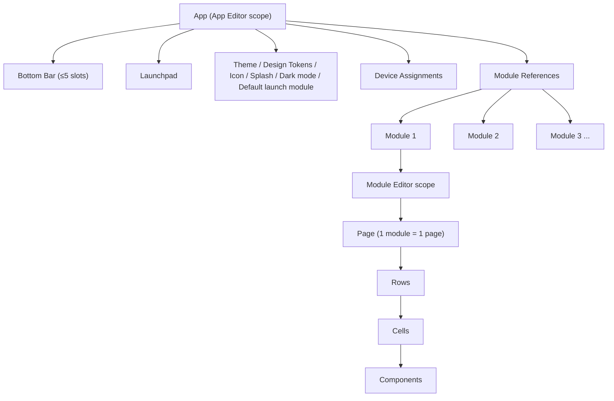

# Feature Feedback 3

This is feature feedback 4 and I will be covering all the things that requires change. 

One more thing is that I want you to write more debug scripts, and just debug hints inside so you can know what is happening. Right now you are just guessing what’s wrong, write debug scripts and debug stuff within the app so that whenever you need to test something out and get the results, you know what exactly went wrong, where did the full process go to, what got executed. All of these is for you to improve efficiency.

# Helm Admin (Web)

My entire idea with testing is that we start with templates. When you create templates, you notice the flaws in the system, maybe there is a lack of feature in this part of the app, maybe there is a bad thing in that part. So you go and fix it, and then when you come back, you keep testing until it’s perfect. When the sample/template is done, your entire backend with all the bugs is basically all fixed. So I want you to when making the template know that you are doing this not only just for the template but for the entire stack. When creating templates, report back any problems that you have when creating and tell which step you are at and repeat. 

## Visual Editor

### Overall UI

This will get an overall overhaul for the structure and UI.

One thing to add is that on the module editor there should be a place to preview the module, and on the app editor there should be a place to preview the entire app. 

### Rows & Cells

Rows now can go to infinity which is perfect. However, I notice when there are more than 8 cells scrolling will just be turned on despite the scrolling settings is off. The minimum width isn’t really enforced to the best of my knowledge. It’s just sort of non existent. 

Cells also should be “auto” in width from the start. Also what is the difference between “flex” and “auto”. Cells are not calculated by percentage right now. There should be a percentage sign for it. How a row gets partitioned should be determined by this. Cells with set width will get their set width, and (100%-(total width of set widths cells)/(total number of auto sized cells) = size of auto sized cells. Sized of auto sized cells needs to always be larger than the min width. The other rule is that 100%-(total width of set width cells) needs to add up to less than 100%. Only if all the cells are set width cells and the total width of set width cells is less than 100% the entire row should be centered and the 2 side is converted to “padding”. if any rule will be broken, the user is blocked from performing the action of they are doing. Perhaps when adding a cell now will break this min cell width rule so they are blocked, or setting a cell width causes this problem. 

When resizing the row boxes with a cursor, the lag is still there, the rows won’t follow up and catch up to the cursor and will teleport to the cursor. This also true for resizing for cells, it will lag behind. Cells is  even worse because it won’t actually follow to where the cursor is pointing to. 

We use to have a drag handler, but now it is gone. I want a drag handler that is to the left of the row. It also needs to be outside of the row, and ideally outside of the canvas. Because if it is inside the canvas it will break the preview. Dragging also needs to be smooth. I don’t know what the situation of it is now. 

Row backgrounds are kind of lame right now. Since cells and white, these row background colors just serve as the borders of cells and rows. 

Cells don’t get stretched with rows, that needs to be fixed. Right now if I increase the height of a row, the cells height just stay that way. 

Row heights are not right too, there is a minimum row height when I use my cursor to drag it up but I can set it below the minimum row height in the config panel when I just type in numbers that’s below that 

Padding is also weird. Padding should have consideration of min width and min height. Right now padding is just shifting the cells in a specific directly. It isn’t really making them smaller. What padding should do is making the row size smaller. but if you pad too much you might encounter issues where you reach the min height and min width limit you need to stop basically. 

Bottom divider just don’t work. 

In addition, I also noticed there is an option to create different kinds of rows, what’s the real difference between footer rows, header rows, and content rows. They are not configurable in the config panel to the right. I personally don’t think this is necessary. Delete. 

The button for removing rows is extremely hard to click. I think it’s within the row in the corner. Make it outside of the row and in the left upper corner. Another QoL thing I want to address is the cells, it’s really painful to remove the cells by clicking remove in the config panel. Cells should have their delete in the upper right corner while the rows removal is on the top left of the entire row so they don’t conflict. make sure the crosses don’t get overlapped or impossible to click. 

When adding cells there should be only atomic components and components. There is no point to have presets in there where it doesn’t mean anything. What I mean by having presets for everything Im talking about just templates in general but right now these are jsut copied over from compoenents. They are basically useless. remove. 

Rows auto resizing still don’t work.

### Text

Pill UI for variables is working but right now it’s a bit glitchy. I cannot type before and after the thing, my cursor will get snap back. There should also be a preview on the screen that actually calls the variable. Right now there is nothing displayed. It is also not functional, nothing displays when I actually preview it in the web admin or on mobile. Please fix variables in general and make sure they are working in any case. 

### Markdown

One thing to note is still the variables system. Right now it doesn’t work at all in markdown. When i try to add one, it just fails, doesn’t display anything. This functionality needs to be added. 

The other thing with this is that markdown just doesn’t render at all. When I try to type # Heading, it stays as that and not turn into an actual heading on the otherside. I also think there might be issue with sizing. 

### Buttons

Buttons should fill the entire cell. Always fill the entire cell. 

Another thing with buttons, it needs to be changed. I think I will elevate buttons to an app level setting if it is about navigating because. Not all modules are going to be in the apps, so having the navigate thing in the module setting isn’t the best.  (TBD, need to rethink, don’t touch yet).

Rules still don’t work. 

### Image

Continue deferring

### Text Input

Rules don’t work for it. 

Text input don’t work at all. This is very buggy. 

From Feature Feedback 2, continue on this:

Overall this works OK. This is the easiest atomic component so I can't complain. One thing is the new data binding thing that got added recently (variables). This doesn't work. I can select a variable such as [[Textuser.name](http://Textuser.name)] from the variables button but when I click that it just replaces the entire text with [[Textuser.name](http://Textuser.name)] and when I push to my frontend it still says [[Textuser.name](http://Textuser.name)]. I don't think this is the right way to do it as it might cause problems. I want it to be like, if you select a variable something distinct is wrapped around it (it might look like a button of some sort) so you will know this is a variable. And instead of saying [[Textuser.name](http://Textuser.name)] it can just say "User Name" in the button so it is way more user friendly. I can do something like: Hello! [[Textuser.name](http://Textuser.name)] but instead it would be more like Hello! [User name] where the brackets is a box.

Please test and make sure this can work with buttons. 

### Icons

Same issue. no chnage at all. 

From feature feedback 2, continue on this and fix this:

What is this garbage. It should be just a drop down, and maybe some size stuff. Why is it just displaying the Icons as just the text and there is a star next to it. What should happen is that there should be just an icon, no text. Why is there a color section to it. This color should instead be the background color of the icon, at most. It also shouldn't need a "Action" section because we already have the button that does this.

### Empty Component

This thing doesn’t work. Right now it completely doesn’t work. It basically should be just the code for rows but done vertically. So I can sort of have a grid but it’s prioritized and grouped in rows then with different sizing columns. Right now none of that is functional. 

### Calendar

Calenar is semi functional, I can select different variants, but when I select week or day they just switch back immediately to month. Compact and Event list also don’t work and immediately swap back to month when I leave the UI. I cannot tell data binding works or not. I can add it, but there is no data or anything. The preview is also not accurate, make it so that it accurately reflect the actual preview. 

### Chat

This needs to be reworked but deferring now

### Notes

I get this error when I try to save it and push it to live: Unprocessable Content

I think this component is not added yet. Plesae make sure this works. Check feature request 2 for more information. 

### Input Bar

I don’t know if this works because all the server functions there are no presets. Please try to test this out and see if it works. 

### Todo

Make sure this is functional. Right now it displays nothing and it’s not functional. 

Unprocessable Content problem also.

### Article card

I also get Unprocessable Content when try to save it and push it live. Please add this component and fix it. 

### Rich Text Renderer

Unprocessable Content problem. 

## Templates

### Home

This template looks nice but there are parts that don’t work.

Let’s go by this row by row.

First of all the heading messsage. Right now it’s in an outdated message format, @user.name should be now converted to a pill UI and you need to test out if it works or not. Everything else here is fine.

Second row, what is the component “Container”. I don’t see that anywhere. Only use existing components or create them then use it. Don’t give template specific ones. In addition, in the container, does that actually work? Does it update and have different weather or is it static? I need it to be dynamic and connected with the weather API. The calendar is also a bit weird. Right now it’s displayed normally but when I go into mobile it’s just like very squished. In this case this should be “compact” instead of monthly. That needs to be fixed.

Third row, Todo component is completely broken and I can’t add it anywhere but somehow I can push this one. This is another case of custom components. When i tell you to create  page (this applies to everything), and you need to need more components, make sure those components are coded as an actual component then add it. Don’t give me junk code. In addition, to do thing appears as a textbox but don’t work at all.

Fourth row,  Same issue of notes with todo. It doesn’t work normally, but somehow I can push these changes. These components are not added properly and you did some magic with the backend to make it work in this template. It also don’t change or have anything. No databinding or anything. These should have its own databinding, this should be the same case for todo too, have databinding.

fifth row. both of these buttons have empty server action and it’s not set to anything. Please make sure these work. Make sure all templates are functional and you can interact with it instead of just thinking it works.

### Chat

This is also bad

Row 1: why is there a setting button here that just leads to the normal settings. This is not needed. I need a setting that leads to the chat related settings instead of the app wide settings. The setting button here also has an empty navigate thing. This needs to be set right. 

Row 2 is using some legacy components (dividers) that no longer exist. Please make sure you add debugging stuff throughout the code so that these errors don’’t happen and they can be removed. This should never happen. The divider still works for some reason.

Row 3: chat is previewing in a weird way and it doesn’t actually work in the mobile side. I cannot send anything. The chat also is very shit. It should have more functions. Do some research online to see if there are any already existing solutions for this. The chat module should also just have its own send button rather than have an external one. 

Row 4 is completely unnecessary as the chat module should have its own send button. 

### Daily Planner

Row 1:The markdown block doesn’t work and in addition, the variables system is outdated, right now with this current form it doesn’t support pill UI and the actual variable setting. 

Row 2: Why is this a custom container. Understand this, please make sure every component is coded, all you are doing when making templates is to use the already coded ones. If the components you want to use doesn’t exist code them. 

### Feed

These sort of work on the mobile but they don’t look right on the visual editor. right now article card and rich text box just shows unknown and it doesn’t work when I add it. Please make sure I can edit them. Also the article card don’t work on mobile. 

### Settings

There is literrally no need to have a template for this. This should be preset and basically unchangeable. 

## Workflows

Right now this is not fully working. some things has nodes that can connect one block to another but things like action just don’t have. 

Please create some templates and test if they work. Right now it’s difficult to do all the editing and the trigger type is bugged. 

I noticed that almost all the drop down don’t work. When I click the drop down and select a choice that I wanted, it briefly flashes to the thing I wanted, and then immediately resets back to the default choice. It’s probably the lack of configuration that has been set up. 

For conditions specific, this is more apparent, I cannot type anything in the conditions place it will just reset back, and at most I can only type 1 character. 

Switches just don’t work at all. 

The shapes of loop is not right. 

Do some research in all of these, there are already existing workflow solutions just grab them from somewhere. 

## Variables & Data sources

Variables sort of work, I don’t know how they work because right now the entire stack is broken. Please make sure your templates can test out all the problems. 

Data sources kind of work but they are super confusing. Because right now non of the components can create stuff in the data sources. i can select the specific data source but nothing happens. The options are also very confusing right now. There should be more hints and all the things like that to explain. I have no idea what to put for connector and there is just a Config JSON for me to fill in.What do I fill in? 

## Connections

This is basically good, we aren’t actually using this jsut yet. One thing I do want to note is the add connetion thing. Right now it only supports 2 types of stuff (weahter API and news API) and custom. Make it so that you can add your own types easily if its just API keys or things like that. So rather than hard coding you can just have it as “Add another type” or something like that. Tackly oauth later. 

## Settings

I don’t want users here. There is no need for multi user. I need multi device management, that is the main thing. There is no point for multiuser. 

# Session 10 — Visual Editor Architecture (2026-04-23)

This section is the architecture extracted from the Session 10 brainstorm ([Session 10 — 2026-04-23 — Visual Editor Module Ordering & Bottom Bar Configuration](https://www.notion.so/Session-10-2026-04-23-Visual-Editor-Module-Ordering-Bottom-Bar-Configuration-b2ab5dd507d64d948987c9abd5136fa6?pvs=21)). It captures every decision, spec, and diagram from that session so the Visual Editor work can be driven from one place.

## Terminology & Core Decisions

- **Modules everywhere.** No more "screens" or "tabs." Every place the current UI says "screen" or "tab" must be renamed to "module." On the mobile side, the bottom bar is an Instagram-style **module switcher**.
- **Admin = end user.** Helm is self-hosted, single user. There is no admin/end-user split. No role system. No multi-user. The person configuring the app *is* the person using the app.
- **1 module = 1 page.** A module is exactly one page. No sub-pages inside a module, no in-module navigation stacks for v1. Page → Rows → Cells → Components hierarchy from Session 4 still holds *within* a module.
- **Modules are shared / function-like.** There is a single module library across the whole admin. One module can be referenced by multiple apps — the same way a function is called from multiple places. Edits to a module propagate to every app that uses it. There are no per-app overrides in v1.
- **Bottom bar = Instagram-style module switcher.** Hard cap of **5 slots**. No soft cap, no scrolling tab bar. 6th module is rejected from the bar.
- **5th-slot "More / Launchpad" is disablable.** The toggle exists because if the user only has 5 modules there is no reason to spend the 5th slot on a More button. Default: **ON**. Can be turned off.
- **Launchpad** holds every module that isn't pinned to the bottom bar. Interior UX = flat searchable scrollable grid. Interior UX is **deferred** — lower priority than getting the editors right.
- **Per-device-ID frontends.** Not per form-factor class (phone / tablet / desktop). Two physical phones can hold completely different configurations. Device identity is the device itself.
- **App ↔ device binding = strict 1:1.** One device holds exactly one app. Multi-app-per-device with an on-device app switcher is explicitly out of scope for v1.
- **Multi-app in the admin.** The admin stores multiple distinct apps. Each app is independently assignable to one or more devices (but each device still holds only one of them at a time).
- **Modules enable/disable flag.** Modules carry a boolean `enabled`. Disabled modules are greyed out in the App Editor module list, still editable in Module Editor, hidden from both the bottom bar and the Launchpad on device.
- **Authentication = plain password for now.** Advanced device-pairing, QR, token-exchange, and OAuth flows are deferred.
- **API-first infrastructure.** The whole app must round-trip as a single JSON via the backend API. Both editor UIs consume that API. No editor-local state that isn't backed by the API. This is a hard requirement because a future agent must be able to edit apps through the same API.

## Two-Editor Architecture

Helm Admin splits the visual editing experience into **two distinct editors**, each with its own surface, its own scope, and its own set of editable metadata. This is a hard split; there is no single "Visual Editor" anymore.

### App Editor (new)

- App-level editor. Operates on an **entire app**.
- Owns: global theme and design tokens, default launch module, app icon + app name + splash screen, dark mode toggle and other system-level settings, bottom bar configuration, Launchpad configuration, the module list for the app, and the device assignment for the app.
- Lives on a new page with a new entry in the global left sidebar. (Placement decision: **Option A** — parallel left-sidebar entry; see Diagrams section below.)

### Module Editor (existing Visual Editor, redesigned)

- Module-level editor. Operates on **one module at a time**.
- Owns: the current page canvas editing (rows, cells, components, properties) and a redesigned module-list control with inline add / delete / rename.
- Continues to live in the existing Visual Editor route.

### Why two editors

- The current Visual Editor conflates module-level editing with app-level configuration (bottom bar ordering, module list, launch defaults). That conflation is the *specific* reason the top `Home ●` dropdown feels cramped and reordering the bottom bar is impossible. Splitting the surfaces resolves both.
- Prior art: this is the same two-editor split **Glide** uses (Tabs editor + Screen editor). It's the closest industry match to what Helm needs.

### Shared-metadata model between the editors

Both editors can edit some of the same fields. Source-of-truth rules:

- **Module name:** editable in **both** editors. Live-synced view of the same underlying field. Not a duplicate.
- **Module icon:** editable in **both** editors. Same live-sync rule.
- **Module order (in the bottom bar):** App Editor only.
- **Bottom-bar slot assignment:** App Editor only.
- **Enabled / disabled flag:** App Editor only (but disabled modules remain editable inside Module Editor).
- **Canvas content (rows, cells, components, properties):** Module Editor only.

### Cross-navigation between editors

- **Drag is the primary interaction** inside the App Editor. You drag modules between bottom-bar slots and Launchpad. Drag never jumps editors.
- **Single-click** on a module in the App Editor module list = **confirmation prompt** before jumping to Module Editor. The prompt exists because drag sessions are frequent and a stray click that instantly leaves the App Editor is disruptive.
- No app-context display inside Module Editor. No "Used in App A, App B" chips. The rename/delete warning modals (see Shared-Module Semantics) carry that context when it actually matters.

## App Editor — Specification

### Visual metaphor (locked: Option a)

- Big **iPhone mockup** in the center of the canvas.
- **Bottom bar slots + Launchpad grid** rendered around the mockup (visually, not just as a form).
- Drag modules between bottom bar and Launchpad directly on the mockup area.
- **Property inspector on the right** for non-visual app-wide settings (theme, design tokens, icon, name, splash, dark mode, default launch module, etc.).
- Rejected alternatives: Option (b) Settings-style form (not visual enough), Option (c) Split surface (redundant once the iPhone mockup is the focal point).

### What the App Editor owns (app-wide metadata)

- Global **theme** and **design tokens**.
- **Default launch module** (which module opens when the app starts).
- App **icon**, app **name**, **splash screen**.
- **Dark mode** toggle and other system-level settings (the set is explicitly open-ended: any system-level preference belongs here).
- **Bottom bar** configuration (order + slot assignments + 5th-slot disable toggle).
- **Launchpad** configuration.
- **Module list** for the app (add a module to this app / remove a module from this app; not module deletion — that's a library-level action).
- **Device assignment** for this app.

### Bottom bar behaviour

- Hard cap of **5 slots**. The UI physically refuses a 6th.
- **5th slot = "More / Launchpad"** by default. Opens the Launchpad when tapped on device.
- **5th-slot disable toggle.** Default **ON**. When OFF, the 5th slot is a normal module slot.
- **Drag-to-dock = iPhone-style swap-or-reject.** Dragging a Launchpad module into a full bottom bar swaps it with an existing slot's module (which falls back to Launchpad). Dragging a 6th module in when the bar is full with the toggle disabled = rejected, no swap.
- Disabled modules cannot be placed on the bar. If you disable a module that is currently in the bar, it drops to Launchpad automatically (and then becomes hidden on device since disabled modules don't render).

### Launchpad

- Holds every non-disabled module that isn't in the bottom bar.
- Interior UX (flat / searchable / scrollable grid) is **deferred** — not v1 priority.
- What's *not* deferred: the Launchpad exists in the App Editor as a drop target alongside the bottom bar, so drag-to-Launchpad works from day one even if the on-device Launchpad rendering is bare-bones.

### App switcher (for multi-app)

- **Dropdown at the top-left of the App Editor page header.**
- Placement decision: **Option (c)** — mirrors where the current `Home ●` module dropdown sits in the Module Editor, so the spatial memory is consistent.
- Rejected alternatives: Option (a) top-left of the canvas iPhone area (too far from global nav), Option (b) top-left of the entire Helm Admin window above the sidebar (conflicts with the Helm logo), Option (d) top tab strip of apps (doesn't scale past a handful of apps).

### Full Preview Mode

- **Preview button** lives in the App Editor.
- Clicking it opens a **popup picker**: choose **Browser** or **Device**.
    - **Browser:** an interactable popup inside the admin panel renders the full app. Must be truly interactable — every component renders, every interaction fires. Target rendering stack: **react-native-web** (or equivalent) so the real React Native components run in the browser. Read-only play is acceptable for a first pass; full interactivity is the end state.
    - **Device:** user picks one of the registered devices. That device shows a **temporary preview screen** driven by preview JSON pushed from the admin. The device's current app is not overwritten — the preview state is ephemeral.
- Both preview backends ship. The user chooses per session; there is no auto-route.

## Module Editor — Specification

### Scope

- Continues to live in the existing **Visual Editor** route in Helm Admin.
- Edits **one module at a time**. The active module's canvas (rows, cells, components) is the focal element.
- Responsible for: canvas editing, module-list CRUD (add / delete / rename), and the live-synced name + icon fields shared with App Editor.
- Not responsible for: module order, bottom-bar slot assignment, enable/disable flag, any app-wide metadata. Those are App Editor only.

### Module switcher (locked: Option (a) — persistent left Modules tree)

- Replaces the current cramped `Home ●` top dropdown as the **primary** CRUD surface for modules.
- Industry prior art for the pattern: FlutterFlow, Draftbit, and IDE conventions (Xcode, VS Code, Figma all use a persistent left tree).
- The Modules tree is a **collapsible Notion-style nested tree** hanging off the global sidebar's existing "Visual Editor" entry. Clicking a module in the tree **deep-links** into the Module Editor with that module loaded.
- Rejected alternatives:
    - Option (b) upgraded top-dropdown panel: loses primary-surface clarity; dropdown still hides state.
    - Option (c) top tab strip: runs out of horizontal space past ≈7 modules; right-click discoverability is low.
    - Option (d) left tree + top dropdown: two ways to do the same thing creates confusion; consumes the most UI real estate.

### Sidebar integration (locked: Option (b) — expand the global sidebar's Visual Editor entry)

- The global Helm Admin left sidebar keeps every current entry: Visual Editor, Templates, Workflows, Variables, Connections, Advanced, Settings.
- The Modules tree is **not** a new sibling item. It is the **expansion of the existing "Visual Editor" entry**, rendered as a Notion-style collapsible nested tree underneath it.
- Rejected alternatives:
    - Option (a) secondary inner panel (`[Global sidebar] [Modules tree] [Structure tree] [Canvas] [Inspector]`): adds a second tree column inside the editor, competing for space with the existing Structure tree.
    - Option (c) sidebar replacement while inside Module Editor: breaks one-click access to Templates / Workflows / etc.

### Inline module actions inside the tree

- **+ New Module** at the bottom / end of the tree.
- **Right-click context menu** on a module: rename / duplicate / delete.
- Rename + delete trigger the shared-module warning modals described in the next section.

### Relationship to the existing Structure tree

- The Structure tree (Row 1 / Cell 1 / component selection) continues to live **inside** the Module Editor canvas area.
- The Modules tree is outside that — it's the sidebar expansion, a level above.
- The two trees are independent: Modules tree switches *which module* you're editing; Structure tree navigates *within* the active module.

### Cross-navigation from App Editor (repeated for clarity)

- Drag inside App Editor never jumps here.
- Single-click on a module in the App Editor module list prompts for confirmation before deep-linking here with that module loaded.

## Shared-Module Semantics & Metadata Ownership

### Module library model

- There is **one global module library** across the entire admin, not a per-app library.
- A single module can be referenced by **multiple apps** simultaneously. Think functions: one definition, many call sites.
- Apps don't "copy" modules. They **reference** modules from the library.

### Edit propagation (locked: global-only)

- All edits to a module are **global**. An edit from App A's context affects App B's usage of the same module.
- **No per-app overrides** in v1. Not even for icon or name. This is a deliberate simplicity choice; per-app overrides can come later if needed.
- Rename propagates everywhere automatically.

### Rename UX (locked: modal with affected-app listing)

- Renaming a module shows a **modal** before committing.
- Modal copy: **"This will be renamed in the following apps:"** followed by the **full list** of apps referencing the module.
- No toast-only path. No blocking checkbox. Just the modal with the list.

### Delete UX (locked: modal with affected-app listing)

- Deleting a module shows a **modal** before committing.
- Modal copy: **"This will affect the following apps:"** followed by the **full list** of apps referencing the module.
- Delete is **not** hard-blocked when a module is in use. User confirms, and it's removed from every app that referenced it.
- Same pattern as rename — one modal shape, two trigger actions.

### Module-usage index

- Backend must maintain a "which apps reference this module" index so the rename / delete modals can list affected apps accurately.
- This index is also what makes the future per-app override system possible if it's ever added.

### Metadata ownership summary (cross-reference to Two-Editor Architecture section)

- **App Editor only:** module order, bottom-bar slot, enable/disable flag, app-wide theme / tokens / icon / name / splash / dark mode, default launch module, device assignment.
- **Module Editor only:** canvas content (rows, cells, components, properties).
- **Both (live-synced, single source of truth):** module name, module icon.
- **Nowhere yet (deferred):** per-app module overrides.

## Multi-App + Device Model

### Multi-app support

- The admin stores **multiple distinct apps** under a single admin user.
- Each app is its own complete configuration: its own module list, its own bottom bar, its own Launchpad, its own theme / icon / name / splash / dark mode / default launch module.
- Apps **share the global module library** (see Shared-Module Semantics). Adding a module to an app = referencing it from the library, not copying.
- You switch between apps in the App Editor via the top-left dropdown.

### Device model (per-device-ID)

- A "device" is a specific physical device, identified by its own per-device ID — not by form-factor class (phone / tablet / desktop).
- **Two phones can hold completely different apps.** That's the point.
- Each device runs its own mobile frontend.

### App ↔ device binding (locked: strict 1:1)

- **One device holds exactly one app.** No on-device app switcher, no multi-app-per-device. Out of scope for v1.
- **One app can be assigned to multiple devices.** Editing that app propagates to every device it's assigned to.
- The binding itself is the responsibility of the App Editor — there's a device assignment UI per app.

### Device registration flow

Flow, in order:

1. Device runs its own mobile frontend (React Native build).
2. Frontend **points itself to an endpoint server** — the self-hosted Helm backend.
3. Device **authenticates** against the endpoint. Auth scheme: **plain password** for now. Advanced flows (QR pairing codes, OAuth, token exchange) are deferred.
4. Device **registers** with the backend — backend assigns / stores a device ID.
5. Device **shows up in the web admin** as a registered device.
6. Admin (Barry) assigns a specific app to that device from the App Editor's device assignment UI.

### Unassigned device state

- A registered device with no app assigned shows a **warning screen** on the device:
    - Copy (canonical): **"no app assigned, use web admin panel to assign."**
- Device stays connected; the warning screen updates to a real app as soon as assignment happens.

### What is explicitly NOT in scope for v1

- Multi-app-per-device with on-device switcher.
- Form-factor-class frontends (phone vs tablet layout automatic adaptation).
- QR / token-exchange / OAuth authentication flows.
- Multi-user / multi-admin.
- Per-device module overrides within a single app (i.e. "App A looks slightly different on Device 1 vs Device 2"). Not needed because per-device-ID already lets you just assign different apps.

## API-First Data Model & Full Preview Mode

### API-first principle

- **Hard requirement:** the entire app config must round-trip as a single JSON through the backend API.
- Both editors (App Editor and Module Editor) are **pure clients of that API**. Neither editor is allowed to keep UI state that isn't expressible via the API.
- Reason: a future agent must be able to edit apps through the exact same API the UI uses. If the UI has state the API can't reach, the agent can't reproduce what the UI does.
- This carries forward the schema versioning principle established in Session 5. Every schema change bumps a version; old JSON payloads are migrated.

### Endpoints (minimum v1 surface)

- `GET /apps/:id` — returns the full app JSON (theme, tokens, icon, name, splash, dark mode, default launch module, bottom bar config, Launchpad config, module list references, device assignments).
- `PUT /apps/:id` — accepts the full app JSON and replaces server state. Full round-trip: whatever came out of GET must be valid input to PUT.
- `GET /devices` — list registered devices with their IDs, connection state, and currently-assigned app.
- `POST /devices` — device self-registration (called by the mobile frontend on first boot after password auth).
- `PUT /devices/:id/app` — assign (or reassign) an app to a specific device. This is the endpoint the App Editor's device assignment UI calls.
- **Module CRUD endpoints: TBD.** Shape follows the same pattern (`GET /modules/:id`, `PUT /modules/:id`, etc.) but the exact surface is deferred until Session 11 / implementation.

### App JSON shape (conceptual)

- `id`, `name`, `icon`, `splash`, `theme`, `designTokens`, `darkMode`, `defaultLaunchModuleId`.
- `bottomBar`: array of up to 5 entries (module IDs or the sentinel "launchpad" slot) + the 5th-slot disable toggle.
- `launchpad`: list of module IDs not pinned to the bottom bar.
- `moduleRefs`: the list of modules this app references (IDs only; module bodies live in the global module library).
- `deviceAssignments`: list of device IDs this app is assigned to.
- Module bodies (rows / cells / components) are **not** embedded in the app JSON. They're fetched separately via module endpoints because they're shared across apps.

### Full Preview Mode (detailed)

- **Entry point:** a Preview button in the App Editor.
- **Picker popup on click:** choose **Browser** or **Device**. Not auto-routed; user picks per session.
- **Browser preview**
    - Opens an interactable popup **inside the admin panel** itself.
    - Renders the full app with every component live.
    - Must be **truly interactable** end-state — every component renders, every interaction fires (button presses, text inputs, navigation, variables all resolve).
    - Target stack: **react-native-web** (or equivalent) so the real React Native components run directly in the browser. Keeps visual + behavioural parity with on-device.
    - First-pass acceptance: read-only visual rendering is OK. End state: full interactivity.
- **Device preview**
    - User picks one of the currently registered devices from the preview picker.
    - Admin pushes a **preview JSON** to that device via the backend.
    - Device shows a **temporary preview screen** driven by the pushed JSON.
    - The device's currently-assigned app is **not overwritten**. Preview state is ephemeral; exiting preview returns the device to its assigned app.
- **Both preview backends ship.** There is no "one or the other" decision — the picker exists because both are valid for different workflows (Browser = fast iteration; Device = real-hardware validation).

## Diagrams

This section collects every diagram produced in Session 10, plus the industry-research comparison table the decisions were grounded in.

### App Editor placement in Helm Admin — Option A (locked)

Option A: new **parallel entry** in the global left sidebar, same tier as Visual Editor / Templates / Workflows / etc.

```
┌─ Helm Admin ───────────────────────────────┐
│                                            │
│ [Sidebar]          [App Editor canvas]     │
│  • App Editor  ◀─ NEW                      │
│  • Visual Editor                           │
│  • Templates                               │
│  • Workflows                               │
│  • Variables                               │
│  • Connections                             │
│  • Advanced                                │
│  • Settings                                │
└────────────────────────────────────────────┘
```

### App Editor placement — rejected alternatives

**Option B — nested under Visual Editor.** Rejected: buries the App Editor under the Module Editor route, which inverts the conceptual hierarchy (apps *contain* modules, not the reverse).

```
• Visual Editor
    • App Editor          ◀ nested, rejected
    • Modules...
• Templates
• Workflows
...
```

**Option C — inside Settings.** Rejected: the App Editor is a primary editing surface, not a configuration screen; hiding it in Settings defeats the point.

```
• Visual Editor
• Templates
• Workflows
...
• Settings
    • App Editor          ◀ buried, rejected
```

**Option D — top-bar tab inside the existing Visual Editor.** Rejected: re-creates the conflation we're breaking apart, and there's no room in the existing top bar.

```
[ Visual Editor ]  [ Tabs: Module Editor | App Editor ]   ◀ rejected
```

### Conceptual hierarchy of an app (mermaid)



### Module Editor switcher — Option (a) persistent left Modules tree (locked)

The primary CRUD surface. Hangs off the global sidebar's Visual Editor entry as a Notion-style collapsible nested tree.

```
┌─ Helm Admin ───────────────────────────────┐
│ [Sidebar]              [Module Editor]     │
│  • App Editor            Canvas            │
│  ▼ Visual Editor         Structure tree    │
│     • Home                Inspector        │
│     • Chat                                 │
│     • Feed                                 │
│     • Daily Planner                        │
│     • + New Module                         │
│  • Templates                                │
│  • Workflows                                │
│  • Variables                                │
│  • Connections                              │
└───────────────────────────────────────┘
```

**Pros:** stable spatial memory, IDE-like, scales past ~7 modules, right-click CRUD is obvious, tree scrolls independently. **Cons:** consumes left-column space (mitigated by making it collapsible).

### Module Editor switcher — rejected alternatives

**Option (b) upgraded top-dropdown panel.** Dropdown still hides the module list until opened; not a primary surface.

```
[ Home ▼ ]   [canvas]
     │
     ▼ on click: expanded panel with list + inline CRUD
```

**Option (c) top tab strip.** Browser-tab-like strip across the top.

```
[ Home | Chat | Feed | Daily Planner | + ]   [canvas]
```

Cons: runs out of horizontal space past ~7 modules, right-click CRUD on tabs is not discoverable, tabs are visually heavy.

**Option (d) left tree + top dropdown.** Both a persistent left tree and a top dropdown.

```
[tree]  [ Home ▼ ]  [canvas]
```

Cons: two ways to do the same thing creates confusion, consumes the most UI real estate, violates one-primary-surface principle.

### Sidebar integration of the Modules tree (locked: Option (b))

The Modules tree **expands** the existing "Visual Editor" entry in the global sidebar. It is *not* a separate inner panel and does *not* replace the global sidebar.

```
[Global sidebar]   [Module Editor canvas area]
 • App Editor       Structure tree  Canvas  Inspector
 ▼ Visual Editor
    • Home
    • Chat
    • Feed
    • + New Module
 • Templates
 • Workflows
 ...
```

**Rejected Option (a) — secondary inner panel:** adds a second tree column inside the editor.

```
[Global sidebar] [Modules tree] [Structure tree] [Canvas] [Inspector]   ◀ rejected
```

Competes with the Structure tree for space; two trees side-by-side is visually noisy.

**Rejected Option (c) — sidebar replacement while inside Module Editor:** the global sidebar temporarily swaps to a Modules-only sidebar.

```
[Modules-only sidebar]  [canvas]   ◀ rejected
```

Breaks one-click access to Templates / Workflows / Variables / Connections while editing a module.

### Industry research — how comparable products handle module/screen switching

| **Product** | **Primary switcher pattern** | **CRUD surface** | **Relevance to Helm** |
| --- | --- | --- | --- |
| Draftbit | Persistent left screens tree | Right-click menu on tree nodes | Direct match for locked Option (a) |
| Adalo | Top screens dropdown + left components panel | Dropdown → rename/delete | Pattern Helm is moving **away from** — the cramped `Home ●` dropdown is the current bad state |
| Xcode / VS Code / Figma | Persistent left file/page/frame tree | Right-click context menu | Establishes that left-tree + right-click CRUD is the universal IDE / design-tool convention |
- **Conclusion:** the locked combination — two-editor split (Glide), persistent left Modules tree (FlutterFlow / Draftbit / IDE convention), globally-shared module library with modals on rename/delete (novel but grounded in the "function-like module" framing) — is the strongest industry-anchored design for Helm's scope.

## Action Items & Deferred Items

### Action items (from Session 10, verbatim intent)

- [ ]  Rename every occurrence of "screen" / "tab" to **"module"** across the admin UI, mobile frontend, and docs.
- [ ]  Build the new **App Editor** as a parallel left-sidebar entry (Option A placement). Visual metaphor = iPhone mockup + bottom bar + Launchpad + right-side property inspector.
- [ ]  Implement **bottom bar** with hard 5-slot cap, 5th-slot "More / Launchpad" default ON, disable toggle, iPhone-style drag-to-dock swap-or-reject behaviour.
- [ ]  Implement **Launchpad** as a drop target in the App Editor (interior on-device UX can stay bare-bones for v1).
- [ ]  Implement **App switcher dropdown** at the top-left of the App Editor page header (Option (c)).
- [ ]  Implement **Module enable/disable flag**: greyed in App Editor list, editable in Module Editor, hidden on device.
- [ ]  Redesign the **Module Editor** switcher as a **persistent left Modules tree** (Option (a)), integrated as a collapsible Notion-style expansion of the global sidebar's "Visual Editor" entry (integration Option (b)).
- [ ]  Remove the cramped `Home ●` top dropdown from the Module Editor.
- [ ]  Add inline module CRUD to the tree: **+ New Module** at the end, right-click context menu for rename / duplicate / delete.
- [ ]  Implement **rename modal**: "This will be renamed in the following apps:" + full list of referencing apps.
- [ ]  Implement **delete modal**: "This will affect the following apps:" + full list of referencing apps. Not hard-blocked.
- [ ]  Make **module name** and **module icon** live-synced between App Editor and Module Editor (single source of truth, editable in both).
- [ ]  Implement **cross-navigation**: drag never jumps editors; single-click on a module in App Editor = confirmation prompt before deep-linking to Module Editor.
- [ ]  Build backend **module-usage index** so rename / delete modals can list affected apps accurately.
- [ ]  Support **multiple apps** per admin. Each app has its own bottom bar / Launchpad / theme / icon / name / splash / dark mode / default launch module / module list / device assignments.
- [ ]  Implement **device model**: per-device-ID identity (not form-factor class), strict 1:1 device↔app binding, one app can be on many devices.
- [ ]  Implement **device registration flow**: device → endpoint server → plain-password auth → register with backend → appears in admin → admin assigns app.
- [ ]  Implement **unassigned device warning screen** on device: "no app assigned, use web admin panel to assign."
- [ ]  Build the **API-first app JSON** round-trip endpoints: `GET /apps/:id`, `PUT /apps/:id`, `GET /devices`, `POST /devices`, `PUT /devices/:id/app`. Ensure GET output is valid PUT input.
- [ ]  Make both editors pure clients of the app JSON API (no unreachable editor-local state).
- [ ]  Carry **schema versioning** from Session 5 forward to every new schema change.
- [ ]  Implement **Full Preview Mode** entry point + **Browser / Device picker popup**.
- [ ]  Implement **Browser preview** using react-native-web (or equivalent), first pass read-only visual, end state fully interactable inside the admin panel.
- [ ]  Implement **Device preview** via admin-pushed ephemeral preview JSON that does not overwrite the device's assigned app.
- [ ]  Update terminology throughout existing Feature Feedback 3 sections ("Visual Editor" entries, etc.) to align with the new two-editor split when touching those areas.

### Deferred items (explicitly out of scope for v1)

- **Launchpad interior on-device UX.** Flat searchable scrollable grid is the target shape but full polish is lower priority than the editors.
- **Multi-app-per-device with on-device app switcher.** Only strict 1:1 for v1.
- **Form-factor-class frontends** (automatic phone vs tablet vs desktop layout). Per-device-ID is the v1 solution instead.
- **Advanced device-pairing flows:** QR pairing codes, token exchange, OAuth. Plain password only for v1.
- **Per-app module overrides** (per-app icon / name / minor tweaks). Global propagation only for v1.
- **Per-device module overrides** within a single app. Not needed — just assign a different app.
- **Workflows, Variables, Connections relocation.** No sidebar reorganisation for these in Session 10; they stay as sibling entries. Revisit in a later session only if user-tested usage demands it.
- **Module CRUD API endpoint shapes.** Pattern is known (`GET/PUT /modules/:id`), exact surface is Session 11 / implementation.
- **Buttons-as-app-level-navigation** (originally raised earlier in this doc under Visual Editor > Buttons). Still TBD; Session 10 did not resolve this, deliberately left for a later session.

### Session summary

Session 10 converted the ambiguous "module ordering + bottom bar" problem from the top of Feature Feedback 3 into a **concrete two-editor architecture** with locked decisions on every major UX axis:

- **Split Visual Editor into App Editor + Module Editor** (Glide-style two-editor pattern).
- **App Editor = iPhone mockup** visual metaphor with drag-to-dock bottom bar and Launchpad; lives as a parallel left-sidebar entry.
- **Module Editor = persistent left Modules tree** (FlutterFlow / Draftbit / IDE convention), integrated as an expansion of the global sidebar's Visual Editor entry.
- **Modules are function-like**: one global library, referenced by many apps, global edits only, with rename/delete modals that list affected apps.
- **Multi-app in admin, strict 1:1 device↔app, per-device-ID identity, plain-password auth.**
- **API-first app JSON** as a hard requirement for both the editors and the future agent.
- **Full Preview Mode** ships with both a Browser backend (react-native-web) and a Device backend (ephemeral JSON push).

The decisions here unblock the entire Visual Editor overhaul mentioned at the top of this Feature Feedback 3 doc and set up Session 11 to tackle API schema detail + Module CRUD endpoints + the deferred Launchpad interior UX.