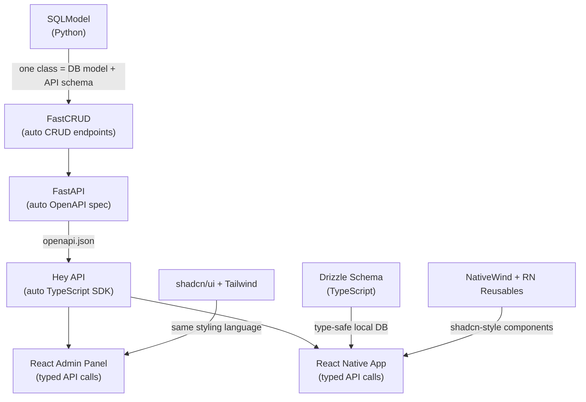

# Modernization Branch — Import Over Build

<aside>
📋

**Branch Purpose:** Replace from-scratch implementations with battle-tested open-source libraries wherever possible. Reduce troubleshooting, speed up development, and leverage community maintenance. This page maps every major Helm component to its best open-source replacement.

**Strategy:** Create a new Git branch (`modernize/import-libraries`). For each section below, swap out the custom implementation for the recommended library, test, then merge. Prioritize by impact (🔴 High → 🟡 Medium → 🟢 Low effort savings).

**Note:** GitHub repo wasn't directly viewable, so recommendations are based on the full architecture documented across Sessions 1–9 in the Project Hub. Cross-reference with actual codebase files when implementing.

</aside>

---

## 🔴 High-Impact Replacements

*These replace the most custom code and eliminate the most troubleshooting.*

### 1. WebSocket Layer → [Socket.IO](http://Socket.IO) (python-socketio + [socket.io](http://socket.io)-client)

**Current:** Custom WebSocket implementation with no documented reconnection/replay strategy. Deployment concern #3 flagged WebSocket reliability on mobile networks as a risk.

**Replace with:**

- **Backend:** `python-socketio` — drops into FastAPI as ASGI middleware. Handles rooms, namespaces, broadcasting, auto-reconnection, HTTP long-polling fallback, binary messages, gzip compression, and CORS. Has Redis/RabbitMQ message queue support for scaling.
- **Frontend:** `socket.io-client` — official React Native support documented. Auto-reconnection with exponential backoff, offline event buffering, acknowledgements for guaranteed delivery.

**What you delete:** Custom WebSocket handler, custom reconnection logic, custom event buffering.

**Install:**

```
# Backend
pip install python-socketio

# Frontend
npm install socket.io-client
```

**Key benefit:** Solves deployment concern #3 (mobile network reliability) out of the box — reconnection, replay, fallback to HTTP long-polling, all built-in.

**Revert:** Remove `python-socketio` from backend, `socket.io-client` from frontend. Restore custom WebSocket handler files.

---

### 2. CalendarModule → react-native-calendars + react-native-big-calendar

**Current:** Custom CalendarModule (month grid + 3-day time-block view) built from scratch as a Tier 3 Composite component.

**Replace with:**

- **`react-native-calendars`** (Wix) — 9.6k+ GitHub stars, MIT license, actively maintained (latest release Jan 2026). Provides month view, agenda view, marking/dot system, customizable themes. Cross-platform iOS/Android.
- **`react-native-big-calendar`** — 700+ stars, MIT license, latest release Jan 2026 (v5 beta). Google Calendar/Outlook-style week/day/3-day time-block views. Drag-and-drop event moving, custom event renderers, swipe navigation.

**What you delete:** Custom month grid renderer, custom time-block layout engine, custom event positioning math, custom gesture handlers for calendar navigation.

**Install:**

```
npm install react-native-calendars react-native-big-calendar
```

**Integration notes:**

- Wrap both libraries inside your existing CalendarModule SDUI component. The SDUI JSON tells the module WHAT data to show; the libraries handle HOW to render it.
- `react-native-big-calendar` supports the exact 3-day time-block view from Session 3 spec natively via its `mode="3days"` prop.
- CalDAV + Notion sync logic (your data layer) stays custom — these libraries only handle rendering.

**Revert:** Uninstall both packages, restore custom calendar renderer files.

---

### 3. ChatModule → Custom on Gifted Chat patterns (or build minimal)

**Current:** Custom multi-threaded ChatGPT-style ChatModule built from scratch.

**Assessment:** `react-native-gifted-chat` (5.3k stars) was the standard but is **no longer actively maintained** (last publish >1 year ago as of 2026). Community has moved on.

**Recommended approach — Hybrid:**

- **Use `react-native-gifted-chat` as a reference architecture** but build a thin wrapper using:
    - **`@shopify/flash-list`** — high-performance list rendering (inverted list for chat). Replaces FlatList with dramatically better scroll performance on large message histories.
    - **`react-native-reanimated`** + **`react-native-gesture-handler`** — for smooth message animations, swipe-to-reply, long-press menus.
    - **`react-native-markdown-display`** — render markdown in AI chat responses natively.

**What you delete:** Custom list virtualization, custom scroll-to-bottom logic, custom message bubble layout.

**Install:**

```
npm install @shopify/flash-list react-native-reanimated react-native-gesture-handler react-native-markdown-display
```

**Why not a full library:** Chat UIs for AI agents (streaming responses, tool call visualization, multi-threaded) are too specialized — no existing library handles this well. But the **underlying rendering primitives** above replace 60-70% of the custom code.

**Revert:** Uninstall packages, restore custom list/animation implementations.

---

### 4. NotesModule → react-native-enriched + react-native-enriched-markdown

**Current:** Custom dual-mode Markdown view/edit NotesModule built from scratch.

**Replace with:**

- **`react-native-enriched`** (Software Mansion, Feb 2026) — fully native rich text editor for React Native. New Architecture (Fabric) only. Synchronous text styling, live style detection, HTML parsing, customizable styles. Uncontrolled input = high performance.
- **`react-native-enriched-markdown`** (Software Mansion Labs) — companion library. Renders Markdown as native text AND provides rich text input with Markdown output. Supports iOS, Android, macOS, Web.

**What you delete:** Custom Markdown parser, custom editor toggle logic, custom rich text rendering, custom keyboard handling.

**Install:**

```
npm install react-native-enriched react-native-enriched-markdown
```

**Key benefit:** Software Mansion (creators of Reanimated, Gesture Handler) built these specifically for the New Architecture. Production-quality, native performance, actively maintained.

**Requirement:** Must be on React Native New Architecture (Fabric). If not already, this is a migration prerequisite.

**Revert:** Uninstall packages, restore custom Markdown editor files.

---

### 5. Admin Panel Framework → Refine

**Current:** Custom 3-panel web admin panel built from scratch (Vite+React+TS at `/admin`). 28+ API endpoints, 5 DB tables, shadcn/ui + React Router + Zustand.

**Replace with:**

- **Refine** (31.7k GitHub stars, MIT license, v5 as of Feb 2026) — React meta-framework for CRUD-heavy applications. Headless architecture (works with ANY UI library including shadcn/ui). Built-in support for:
    - Data providers (REST, GraphQL, custom) — connect directly to your FastAPI endpoints
    - Authentication & access control
    - Routing (React Router supported)
    - Real-time updates
    - Audit log
    - i18n
    - TypeScript-first

**What you keep:** Your existing shadcn/ui components, Zustand stores, and React Router setup.

**What Refine replaces:** Custom CRUD logic for all 14 SQLAlchemy models, custom list/filter/sort/paginate UI, custom form handling, custom authentication flow, custom audit log display.

**Install:**

```
npm install @refinedev/core @refinedev/react-router @refinedev/simple-rest
```

**Why Refine over react-admin:** Refine is headless (no forced UI — keeps your shadcn/ui), MIT licensed (all enterprise features free), supports React Router (you already use it), and has better TypeScript support. react-admin forces MUI and gates enterprise features behind paid license.

**Admin dashboard section:** Keep the visual SDUI editor custom (it's your core product differentiator). Use Refine only for the Admin Dashboard side (user management, session management, audit logs, system stats, component registry CRUD, data source management).

**Revert:** Uninstall Refine packages, restore custom CRUD implementations.

---

### 6. Backend Admin (DB Management) → SQLAdmin

**Current:** Custom admin endpoints for managing SQLAlchemy models directly.

**Replace with:**

- **SQLAdmin** (2.7k stars, MIT license) — auto-generates admin UI from SQLAlchemy models. One-line integration with FastAPI. Handles all 14 of your SQLAlchemy models automatically.
- **Alternative:** `sqladmin-ng` — actively maintained fork of SQLAdmin (drop-in replacement, same API).

**What you delete:** Custom model management endpoints, custom admin UI for DB records.

**Install:**

```
pip install sqladmin
```

**Integration:** Mount alongside your existing FastAPI app. Complements (not replaces) the React admin panel — SQLAdmin is for direct DB model management, the React panel is for the SDUI editor experience.

**Revert:** Remove SQLAdmin mount from FastAPI app, restore custom admin endpoints.

---

### 7. Variable/Template System → Mustache.js

**Current:** Custom Mustache expression resolver built from scratch (Session 8). Dot-path variable resolution with 6 scopes.

**Replace with:**

- **`mustache.js`** (16k+ stars, MIT license, zero dependencies) — the reference implementation of Mustache templates in JavaScript. Your Session 8 spec literally chose "Mustache `expression` syntax" — so use the actual Mustache library instead of reimplementing.

**What you delete:** Custom template parser, custom dot-path resolver, custom scope lookup.

**What stays custom:** The 6-scope variable context builder (`user.*`, `component.*`, `self.*`, `data.*`, `env.*`, `custom.*`) — you still need to assemble the context object. But the actual template rendering is handled by mustache.js.

**Install:**

```
npm install mustache
```

**Revert:** Uninstall mustache, restore custom resolver.

---

## 🟡 Medium-Impact Replacements

*Solid improvements that reduce maintenance burden.*

### 8. Local Database → expo-sqlite (or WatermelonDB)

**Current:** Custom local-first SQLite implementation for Universal Data Architecture.

**Replace with:**

- **`expo-sqlite`** — Expo's official SQLite module. Synchronous & async APIs, TypeScript, Expo managed workflow compatible, New Architecture support. Best choice since you're already on Expo.
- **Alternative for scale:** `WatermelonDB` — if you need reactive queries, lazy loading, and handling 10k+ records with smooth UI performance. Built on SQLite under the hood, but adds an ORM-like layer with observable queries.

**Install:**

```
npx expo install expo-sqlite
```

**Key benefit:** expo-sqlite is maintained by the Expo team and guaranteed compatible with your Expo setup. No native module bridging headaches.

**Revert:** Revert to previous SQLite implementation.

---

### 9. Drag-and-Drop (Editor) → react-native-reanimated-dnd

**Current:** Custom mouse event handlers for DnD in the web admin editor (row reorder, component move, resize handles).

**For the React admin panel (web):**

- **`@dnd-kit/core`** — the modern standard for React DnD. Lightweight, accessible, extensible. Supports sortable lists, grids, drag handles, collision detection.

**For future React Native DnD (if needed):**

- **`react-native-reanimated-dnd`** — built on Reanimated 4 + Gesture Handler. 60fps animations, sortable lists & grids, collision detection, auto-scrolling, TypeScript.

**Install:**

```
# Web admin
npm install @dnd-kit/core @dnd-kit/sortable @dnd-kit/utilities

# React Native (future)
npm install react-native-reanimated-dnd
```

**Revert:** Uninstall DnD packages, restore custom mouse event handlers.

---

### 10. Form Handling (Admin Panel) → React Hook Form + Zod

**Current:** Custom form handling across admin panel.

**Replace with:**

- **`react-hook-form`** — already in your planned stack (Session 6 listed it). Uncontrolled inputs = high performance. Built-in validation, error handling, TypeScript.
- **`zod`** — schema validation that pairs with both React Hook Form (frontend) and Pydantic (backend concept alignment).

**Install:**

```
npm install react-hook-form @hookform/resolvers zod
```

**Revert:** Uninstall packages, restore custom form logic.

---

### 11. MCP Layer → Official MCP Python SDK

**Current:** Custom MCP over StreamableHTTP implementation with 22 MCP tools.

**Replace with:**

- **`mcp` (Official Python SDK)** — maintained by Anthropic (Samuel Colvin from Pydantic helps maintain it). Full MCP spec implementation: stdio, SSE, and Streamable HTTP transports. FastMCP helper for quick server setup.
- **PydanticAI has native MCP support** — `MCPServerHTTP` and `MCPServerStdio` classes. Since you're already using PydanticAI, use its built-in MCP client rather than building your own.

**Install:**

```
pip install "mcp[cli]"
```

**What stays custom:** Your 22 tool definitions (the business logic). What changes: the transport and protocol handling layer.

**Revert:** Remove `mcp` package, restore custom MCP transport code.

---

### 12. Authentication → fastapi-users or authlib

**Current:** Custom JWT session-based auth. CLI-only user creation. No rate limiting on login (flagged as security concern).

**Replace with:**

- **`fastapi-users`** (4.5k stars) — complete auth system for FastAPI. JWT + cookie support, user registration, password reset, email verification, OAuth2 (Google, GitHub, etc.), role-based access. SQLAlchemy backend adapter included.

**Install:**

```
pip install "fastapi-users[sqlalchemy]"
```

**Key benefit:** Solves multiple deferred security concerns from Session 2: rate limiting, session invalidation on logout, proper token management.

**What stays custom:** CLI-only user creation policy (just disable the registration endpoints in fastapi-users config).

**Revert:** Uninstall fastapi-users, restore custom auth endpoints.

---

## 🟢 Lower-Impact but Worth Doing

*Quick wins and quality-of-life improvements.*

### 13. Charts → Recharts (web) + react-native-svg-charts or Victory Native

**Current:** Server-rendered matplotlib PNGs (deployment concern #5 — lifecycle management, orphaned files).

**Replace with:**

- **Web admin:** `recharts` — already in your planned stack (Session 6). React-native charting.
- **Mobile (future):** `victory-native` or `react-native-svg-charts` — render charts natively instead of loading server PNGs. Eliminates deployment concern #5 entirely.

**Install:**

```
# Web admin (already planned)
npm install recharts

# Mobile
npm install victory-native react-native-svg
```

**Revert:** Uninstall chart packages, restore matplotlib PNG generation.

---

### 14. Toast/Notifications UI → Sonner (web) + react-native-toast-message

**Current:** Custom `show_notification` action (toast/banner) in action system.

**Replace with:**

- **Web:** `sonner` — already in your planned stack. Beautiful toast notifications.
- **Mobile:** `react-native-toast-message` — customizable toast component, no native linking required.

**Install:**

```
npm install sonner react-native-toast-message
```

**Revert:** Uninstall packages, restore custom toast implementation.

---

### 15. State Management → Zustand ✅ (Already using — keep it)

**Current:** Zustand for Component State Registry.

**Assessment:** Zustand is the right choice. 50k+ stars, tiny bundle, works great in both React and React Native. No change needed.

---

### 16. Navigation → Expo Router

**Current:** Unknown navigation setup.

**Recommended:** `expo-router` — file-based routing for Expo apps. If not already using it, it's the standard for Expo projects in 2026. Deep linking, typed routes, shared layouts.

**Install:**

```
npx expo install expo-router
```

---

## 📊 Impact Summary

| **#** | **Component** | **Library** | **Impact** | **Custom Code Eliminated** |
| --- | --- | --- | --- | --- |
| 1 | WebSocket | [Socket.IO](http://Socket.IO) | 🔴 High | Reconnection, buffering, fallback |
| 2 | Calendar | RN Calendars + Big Calendar | 🔴 High | Month grid, time-block, gestures |
| 3 | Chat rendering | FlashList + Reanimated + MD | 🔴 High | List virtualization, animations |
| 4 | Notes editor | RN Enriched + Enriched MD | 🔴 High | Rich text editor, MD parsing |
| 5 | Admin CRUD | Refine | 🔴 High | All CRUD logic for 14 models |
| 6 | DB Admin | SQLAdmin | 🔴 High | Model management endpoints |
| 7 | Variable resolver | Mustache.js | 🔴 High | Template parser, dot-path resolver |
| 8 | Local DB | expo-sqlite | 🟡 Medium | SQLite wrapper, async handling |
| 9 | Drag and Drop | @dnd-kit + RN Reanimated DnD | 🟡 Medium | Custom mouse/gesture handlers |
| 10 | Forms | React Hook Form + Zod | 🟡 Medium | Custom form/validation logic |
| 11 | MCP transport | Official MCP SDK | 🟡 Medium | Custom MCP transport layer |
| 12 | Auth | fastapi-users | 🟡 Medium | JWT handling, session mgmt |
| 13 | Charts | Recharts + Victory Native | 🟢 Low | matplotlib PNG pipeline |
| 14 | Toasts | Sonner + RN Toast Message | 🟢 Low | Custom notification UI |

---

## 🔬 Deep Dive: Visual SDUI Editor

*This was originally listed as "keep custom" — but the editor is the biggest pain point. Here's every option investigated.*

<aside>
⚠️

**Problem Statement:** The 3-panel visual SDUI editor (canvas + component list + property inspector) was built entirely from scratch. Puck was evaluated in Session 7 and rejected. But the editor space has evolved significantly since then. Here's a full landscape analysis.

</aside>

### Option A: Puck 0.21 (Re-evaluate — it's changed a lot)

**What it is:** Open-source MIT visual editor for React. 12.5k stars. Version 0.21 released Jan 2026.

**What's new since Session 7 rejection:**

- **AI page generation** — built-in AI beta for generating pages from your component config
- **Rich text editing** — new `richtext` field type with inline canvas editing (built on TipTap)
- **Plugin Rail** — new left sidebar with plugin system (Blocks, Outline, Fields plugins by default)
- **Custom slot elements** — `as` prop lets you replace the default `div` with any HTML element or component
- **TypeScript declaration merging** — extend `ComponentConfig`, `Metadata`, and `Field` types
- **resolveData on move** — resolveData now fires when components move between slots
- **Parent-aware permissions** — `resolvePermissions` and `resolveData` both receive parent `ComponentData`
- **Full-screen canvas mode** — experimental prop removes empty space around canvas
- **Delete/backspace hotkeys** — keyboard shortcuts for removing components
- **Mobile UI** — plugin rail adapts to bottom of screen on mobile

**How it could work for Helm:**

- Register your SDUI components (Structural, Atomic, Composite) as Puck components
- Puck outputs JSON — map Puck's JSON schema to your SDUI JSON schema via a transformer
- Use Puck's Plugin Rail to add custom panels (AI guidelines, data binding config, trigger setup)
- Use permissions API to restrict what non-admin users can do
- Keep your custom property inspector as a Puck plugin if needed

**Strengths:**

- Free-form drag-and-drop with visual preview of where elements land
- Works with ANY React components including shadcn/ui
- Exports JSON (not HTML) — aligns with your SDUI architecture
- Plugin system means you can extend without forking
- Active community, Discord support, regular releases

**Weaknesses:**

- Still pre-1.0 (APIs may change)
- No real-time collaboration built-in
- No built-in storage (you handle persistence)
- The JSON output format is Puck-specific — you'd need a bidirectional transformer to convert between Puck JSON and Helm SDUI JSON

**Verdict: 🟡 WORTH RE-EVALUATING.** The Plugin Rail and AI generation are game-changers. The Session 7 rejection may no longer apply. Build a proof-of-concept with 3-4 of your SDUI components registered in Puck and see if the DX is acceptable.

**Install:**

```jsx
npm install @puckeditor/core
```

---

### Option B: Craft.js (Build-your-own editor framework)

**What it is:** React framework for building page editors. 8.6k stars, MIT license.

**Latest release:** Feb 2025 (v0.2.7). Development has slowed — creator is working on Reka (new state management system for Craft).

**How it works:**

- You define "User Components" with drag/drop rules
- Craft provides the Editor context, drag-and-drop engine, and node tree
- You build ALL the UI yourself (sidebar, toolbar, canvas, property panel)
- Exports/imports JSON (serialized node tree)

**Strengths:**

- Maximum control — you build every pixel of the editor UI
- React-native (uses your actual React components)
- JSON serialization/deserialization built-in
- Drag/drop rules per component (canDrag, canMoveIn, canMoveOut)

**Weaknesses:**

- **No UI out of the box** — you're building the editor from scratch, which is what you're already doing
- Development has slowed significantly (last release Feb 2025, creator working on successor project "Reka")
- JSON output format is Craft-specific (flat node map, not a tree) — needs transformation
- No plugin system
- Smaller community than Puck

**Verdict: 🔴 SKIP.** Craft.js gives you a drag-and-drop engine but you still build everything else custom. It doesn't solve the "building from scratch" problem — it just gives you slightly better DnD primitives. The slowed development is also a concern.

---

### Option C: GrapeJS (Web page builder framework)

**What it is:** Open-source BSD-3 visual editor framework. 23k+ stars. Focused on web page/email building.

**Strengths:**

- Mature, battle-tested (been around since 2016)
- Exports HTML + CSS (useful for web)
- Large plugin ecosystem
- Studio SDK now supports React component rendering

**Weaknesses:**

- **HTML/CSS-centric, not JSON-schema-centric** — fundamentally misaligned with your SDUI approach
- React integration is about the editor UI chrome, NOT about using React components as building blocks
- Steep learning curve, JS-only API (not React-native)
- Would require massive adapter layer to convert HTML output → SDUI JSON
- Not designed for mobile component editing

**Verdict: 🔴 SKIP.** Wrong paradigm entirely. GrapeJS is for building web pages with HTML/CSS, not for composing mobile SDUI screens from a component registry.

---

### Option D: Composify (SDUI-native visual editor — NEW)

**What it is:** Open-source visual editor specifically for Server-Driven UI. Launched Dec 2025 on GitHub.

**How it works:**

- Register your existing React components in a Catalog
- Components become drag-and-drop blocks in a visual editor
- Stores output as **JSX strings** (not JSON, not HTML)
- Has both visual mode and code mode (always in sync)
- Multi-viewport preview (mobile, tablet, desktop)
- Framework agnostic (Next.js, Expo, React Router)

**Strengths:**

- **Purpose-built for SDUI** — not a page builder adapted for SDUI
- Drop-in integration — no component rewrites, just register and go
- JSX string output is human-readable
- Dual visual + code editing modes
- Used in production at the creator's previous startup (handled 60% of traffic)
- TypeScript support

**Weaknesses:**

- **Very new** (Dec 2025) — small community, limited battle-testing
- JSX string output (not JSON) — you'd need JSX→SDUI JSON transformer
- No mention of plugin system or extensibility beyond component registration
- React-only (no React Native editor, though output can target RN)
- Unknown maintenance trajectory

**Verdict: 🟡 INTERESTING BUT RISKY.** The SDUI-native approach is exactly right, but the project is too new to bet your editor on. Worth watching. Could be a great fit in 6 months if it matures.

---

### Option E: Nativeblocks (Managed SDUI platform with visual editor)

**What it is:** Commercial SDUI platform with native SDKs for iOS, Android, and React Native.

**What's included:**

- Visual editor for building layouts (no JSON by hand)
- Cross-platform SDKs (React Native TypeScript SDK available)
- Analytics, A/B testing, rollback
- Free tier available, pay-as-you-go pricing ($9/member, $30/language)

**Strengths:**

- Production-ready visual editor out of the box
- React Native SDK exists
- Built-in experimentation and analytics

**Weaknesses:**

- **Commercial / managed** — vendor lock-in, ongoing costs
- Last npm publish 5 months ago (less active than expected)
- You lose control of the SDUI pipeline
- Your component registry and schema are Helm-specific — Nativeblocks has its own schema
- Doesn't align with your self-hosted, open-source philosophy

**Verdict: 🔴 SKIP.** Vendor lock-in and commercial model don't fit Helm's architecture. Your SDUI schema is too custom.

---

### Option F: ObjectUI (SDUI engine — web only, for admin panel)

**What it is:** Universal SDUI engine built on React + Tailwind + Shadcn. From ObjectStack AI.

**What's included (Phase 1-3 complete as of Q2 2026):**

- 40+ production-ready Shadcn components
- Expression system with field references
- Action system (AJAX, chaining, conditions) — similar to your 19-action system
- Visual designer (beta)
- Advanced field types, validation engine, query schema

**Strengths:**

- **Shadcn/Tailwind stack matches your admin panel exactly**
- Action system with chaining/conditions mirrors your architecture
- Schema-driven — define UI in JSON, engine renders it
- Could replace a chunk of your admin panel's custom SDUI rendering

**Weaknesses:**

- Web-only (React + Tailwind) — no React Native renderer
- Tied to ObjectStack AI ecosystem
- Young project, unclear community size
- Would only help the admin panel side, not the mobile SDUI renderer

**Verdict: 🟡 PARTIAL FIT.** Could power parts of your admin dashboard (system stats, data tables, forms) since it speaks the same Shadcn language. Won't help with the visual SDUI editor or mobile renderer.

---

### 📋 Visual Editor Recommendation

<aside>
✅

**Best path forward: Hybrid approach using Puck 0.21 for the editor chrome + your custom SDUI logic**

1. **Use Puck as the drag-and-drop canvas and component panel** — it handles the annoying parts (DnD engine, component drawer, undo/redo, viewport switching, keyboard shortcuts)
2. **Build your SDUI-specific panels as Puck Plugins** — property inspector with data binding, trigger config, AI guidelines all live in the Plugin Rail
3. **Write a bidirectional JSON transformer** — Puck JSON ↔ Helm SDUI JSON
4. **Keep your component registry** — register your Structural/Atomic/Composite components as Puck components
5. **Fallback plan:** If Puck doesn't fit after prototyping, use `@dnd-kit/core` for the DnD engine only and keep your custom panels. This is less integrated but still eliminates the custom DnD code.
</aside>

---

## 🔬 Deep Dive: Updated Component Findings

*Additional research findings that upgrade or modify the original recommendations.*

### Local Database: op-sqlite as a superior alternative

**Original recommendation:** expo-sqlite

**Updated finding:** `op-sqlite` (by Oscar Franco, MIT license) is **2-10x faster** than expo-sqlite in benchmarks.

- **JSI-based** — communicates directly with native layer synchronously (no bridge serialization)
- **Features:** SQLCipher encryption, FTS5 full-text search, cr-sqlite for CRDTs, sqlite-vec for AI embeddings, reactive queries, JSONB support, built-in key-value store
- **Benchmarks:** iPhone 15 Pro — op-sqlite: 507ms vs expo-sqlite: 2293ms (4.5x faster)
- **Expo compatible** — works with Expo bare workflow and dev builds
- **Trade-off:** Smaller community than expo-sqlite, requires Expo dev builds (not Expo Go)

**New recommendation:**

- **Default:** expo-sqlite (if simplicity and Expo Go compatibility matter)
- **Performance-critical:** op-sqlite (if you need speed for large datasets, AI embeddings, or encrypted storage)
- **Offline-first with sync:** WatermelonDB (if you need reactive queries + sync protocol)

```jsx
# Option A: Simple
npx expo install expo-sqlite

# Option B: Performance
npm install @op-engineering/op-sqlite

# Option C: Offline-first ORM
npm install @nozbe/watermelondb
```

---

### Notes Editor: Deeper findings on react-native-enriched

**Original recommendation stands**, but here's more detail:

- **react-native-enriched** (v0.3.0, published Apr 2026) — actively maintained by Software Mansion core team
- **Imperative API** for style toggling (bold, italic, etc.) — not prop-driven, which means better performance
- **HTML output** — clean HTML, not proprietary format
- **Limitations found in GitHub discussions:**
    - No HTML table support yet (requested Sep 2025)
    - No text background color support yet (requested Oct 2025)
    - Markdown output support was requested and closed (use enriched-markdown companion instead)
    - Cursor position API for mentions is missing (requested Oct 2025)
- **react-native-enriched-markdown** (v0.3.0, published Apr 2026) — CommonMark + GFM compliant, RTL support, VoiceOver/TalkBack accessibility, native image interactions
- **Hard requirement:** New Architecture (Fabric) only. If you're still on the old architecture, this is a blocker.

---

### Admin Panel: Refine vs react-admin — deeper comparison

**Original recommendation (Refine) confirmed**, with additional context:

| **Feature** | **Refine v5** | **react-admin v5.14** |
| --- | --- | --- |
| UI Library | **Headless** (use anything — shadcn, MUI, Ant) | Forces MUI |
| License | MIT (everything free) | MIT core, **paid** enterprise features |
| React Router | ✅ Native support | Uses own routing |
| TypeScript | First-class, strict types | Supported but less strict |
| Stars | 31.7k | 25k |
| FastAPI integration | Custom data provider (REST) — ~50 lines | Custom data provider — similar effort |
| Audit log | Built-in | Enterprise (paid) |
| Real-time | Built-in | Enterprise (paid) |
| Learning curve | More boilerplate initially | More "magic", less boilerplate |

**Note from react-admin creator (on HN):** The react-admin creator has publicly called Refine a "copycat" — take the rivalry with a grain of salt. Both are mature. Refine wins for Helm because it's headless (keeps your shadcn/ui) and has no paid tiers.

---

### Drag and Drop: @dnd-kit confirmed as best choice

**2026 landscape:**

- **@dnd-kit** — the default for React DnD in 2026. Small, accessible, actively maintained.
- **Pragmatic Drag and Drop** (Atlassian) — better raw performance at Jira/Trello scale, but documentation is Atlassian-centric and Apache-2.0 license has considerations.
- **react-beautiful-dnd** — **deprecated** (Atlassian abandoned it). Do not use.

**Recommendation unchanged:** `@dnd-kit` for the web admin editor. If you later need DnD on mobile, `react-native-reanimated-dnd`.

---

### Authentication: Expanded options

**Original recommendation (fastapi-users) confirmed**, but adding alternatives:

1. **fastapi-users** (4.5k stars) — best for quick setup. JWT + OAuth2 + email verification. SQLAlchemy adapter included. Disable registration endpoints for your CLI-only policy.
2. **Authlib** — better if you need to be an OAuth2 **server** (i.e., third-party apps authenticating against Helm). Full OIDC support. More manual setup.
3. **WorkOS / PropelAuth / Auth0** — managed auth services. Overkill for Helm's current scale, but worth knowing about for future enterprise features.

**Stick with fastapi-users** for now. It solves the immediate security concerns (rate limiting, session invalidation, proper token management) with minimal code.

---

### [Socket.IO](http://Socket.IO): Confirmed with RN-specific notes

**React Native integration confirmed working** — official docs at [socket.io/how-to/use-with-react-native](http://socket.io/how-to/use-with-react-native).

**Key RN-specific tips:**

- Set `transports: ["websocket"]` explicitly to avoid falling back to HTTP polling (which triggers Android timer warnings)
- Connection URL varies by platform during development ([localhost](http://localhost) doesn't work on Android emulator — use `10.0.2.2`)
- [Socket.IO](http://Socket.IO) v4 is current stable — v5 exists but is less documented for RN

---

## 🏢 Enterprise SDUI Landscape — What the Big Players Actually Use

*You asked: "Editors that Airbnb or Instagram uses — it should exist somewhere right?" Here's the honest answer.*

<aside>
💡

**TL;DR:** Most big companies (Airbnb, Meta/Instagram, Uber, Netflix, Shopify, Lyft) built **proprietary internal** SDUI systems that are NOT open source. However, the architectural patterns are well-documented, and some underlying components ARE open source. The two closest open-source equivalents to what these companies built are **DivKit** (Yandex) and **Rise Tools** (React Native-specific). Helm's architecture is actually already very close to how Airbnb's Ghost Platform works.

</aside>

---

### 🔒 Proprietary Systems (Not Open Source — But Patterns You Can Learn From)

| **Company** | **System Name** | **What It Does** | **Open Source?** | **Key Takeaway for Helm** |
| --- | --- | --- | --- | --- |
| **Airbnb** | Ghost Platform (GP) | Unified SDUI across iOS, Android, Web. GraphQL schema defines reusable "Sections" and "Screens". Backend controls layout, data, AND actions. Uses `SectionComponentType` to render same data model differently. | 🔴 No | **Your architecture mirrors GP closely.** GP's Section = your Atomic/Composite components. GP's Screen = your Row-by-Row layout. GP's IAction = your Action System. You're on the right track — GP validates your approach. |
| **Meta / Instagram** | Bloks | Internal SDUI framework. UI driven from Hack (XHP). Uses **Yoga** (flexbox layout engine), **ComponentKit** (iOS), **Litho** (Android) underneath. Bloks.js for web. Powers Instagram, Facebook Messenger (Project Lightspeed cut codebase by 70%). | 🔴 Bloks is private. 🟢 **Yoga, ComponentKit, Litho are open source.** | Meta doesn't publish the SDUI orchestrator itself, but the rendering primitives are open source. **Yoga** is used by React Native already (it's how RN does flexbox). You're indirectly using Meta's stack. |
| **Uber** | Internal SDUI | Reported **10x feature velocity** on dozens of features. Details from InfoQ talk. | 🔴 No | Validates SDUI at massive scale. |
| **Netflix** | Internal SDUI | Uses SDUI for targeted lifecycle flows (onboarding, upsell, etc.). | 🔴 No | SDUI doesn't have to power everything — Netflix uses it selectively for high-iteration surfaces. |
| **Shopify** | Shop App SDUI | Server-driven Store Screen. Components are server-defined, supports backward-compatible versioning for older client versions. | 🔴 No | Their versioning approach ("what if client doesn't know this component?") is something Helm should implement — **fallback rendering for unknown component types.** |
| **Lyft** | Multiple SDUI systems | Started with Bikes & Scooters team, spread organically. Uses "semantic components and actions" pattern. Now uses SDUI for Live Activities too. | 🔴 No | Lyft's "semantic components" (components with meaning, not just layout) aligns with Helm's Tier system. Also proves SDUI works for real-time features. |
| **Nubank** | BDC (Backend Driven Content) | Serves 1000+ screens to 100M+ users. 70% of new screens and 43% of entire app runs on BDC. Flutter + Clojure backend. | 🔴 No | Largest known SDUI deployment by screen count. Proves SDUI scales to near-total app coverage. |
| **Delivery Hero** | Fluid | Templates + widget models + widget factories. Offline caching, type-safe data binding, forward/backward versioning compatibility. | 🔴 No | Their template editor concept is similar to what you're building in the admin panel. |
| **PhonePe** | LiquidUI | Deploys UI updates multiple times daily without app releases. | 🔴 No | High-velocity deployment validation. |
| **Zalando** | Appcraft | Dynamic user personalization through SDUI. | 🔴 No | Personalization is a future Helm use case (AI-adapted UIs per user). |

---

### 🟢 Open-Source SDUI Frameworks You Can Actually Use

#### 🐋 DivKit (Yandex) — The Most Production-Proven Open-Source SDUI

**What it is:** Full-blown open-source SDUI framework by Yandex (the "Google of Russia"). Powers Yandex's own apps at massive scale.

- **GitHub:** [github.com/divkit/divkit](http://github.com/divkit/divkit)
- **License:** Apache 2.0
- **Platforms:** Android (native), iOS (native), Web, Flutter (in development)
- **Stars:** 5k+

**How it works:**

- You define layouts in JSON using DivKit's schema
- DivKit SDKs render them natively on each platform
- Supports: containers, text, images, buttons, galleries, pagers, inputs, states, animations, variables, triggers, timers, patches
- Has **templates** for reusable components (inheritable, composable)
- **State management** built-in — elements change appearance on state change
- **DSL generators** in Kotlin, TypeScript, and Python for creating JSON programmatically
- Has an [interactive playground](https://divkit.tech/playground) for testing layouts

**Fit for Helm:**

- 🟡 **Partial fit.** DivKit is powerful but uses its OWN component set (not your React components). You can't register custom React Native components as DivKit blocks — you'd use DivKit's built-in elements instead.
- DivKit's JSON schema is well-designed and could **inspire** improvements to Helm's SDUI schema (especially their template/inheritance system and state management).
- **No React Native SDK** — Android, iOS, Web only. Would need a React Native wrapper or WebView integration.
- **Best use case for Helm:** Study DivKit's JSON schema design, template inheritance, and state change model. Potentially use DivKit's **Python DSL** on your FastAPI backend to generate SDUI JSON.

```jsx
# Backend DSL (Python)
pip install divkit

# Or study the schema design
# https://divkit.tech/playground?samples=1
```

---

#### 🚀 Rise Tools — Server-Defined Rendering for React Native

**What it is:** Open-source framework specifically built for React Native SDUI. Server defines UI in JSX/TypeScript, client renders it natively.

- **Website:** [rise.tools](http://rise.tools)
- **GitHub:** [github.com/rise-tools/rise-tools](http://github.com/rise-tools/rise-tools)
- **License:** Apache 2.0
- **Platform:** React Native (Expo compatible)

**How it works:**

- **Server side:** Write UI in TypeScript/JSX on a Node.js server. Define `view` models with state and event handlers.
- **Client side:** `<Rise>` component connects to server via WebSocket, receives component tree, renders using a local component library.
- **Live updates:** Change server code → UI updates instantly in the app (no rebuild).
- **Kit:** Comes with `@rise-tools/kitchen-sink` (Tamagui-based components), but you can register **your own components**.
- **Navigation:** Supports Expo Router and React Navigation integration.
- **Playground app:** Available on App Store and Play Store for instant testing.

**Fit for Helm:**

- 🟡 **Architecturally aligned but different paradigm.** Rise uses TypeScript/JSX on the server (not JSON). Helm uses JSON schemas rendered by a client-side engine.
- Rise's model: Server sends component tree → Client renders. Helm's model: Server sends JSON → Client interprets JSON → Client renders.
- **Key difference:** Rise runs a **Node.js server**, Helm runs **Python/FastAPI**. Rise's server-side JSX wouldn't work with your Python backend without a Node sidecar.
- **What you can borrow:** Rise's component registration pattern, WebSocket-based live update model, and the `<Rise>` client-side rendering component architecture.
- **⚠️ Warning:** The README literally says "WORK IN PROGRESS. Please, do not use this yet!" — treat as inspiration, not production dependency.

```jsx
# If you want to experiment
npm create rise@latest

# Client-side component
npm install @rise-tools/react @rise-tools/ws-client @rise-tools/kitchen-sink
```

---

#### 🎵 Ensemble UI — Declarative Cross-Platform App Builder

**What it is:** Open-source platform for building native apps through a declarative language (YAML-like DSL). Server-driven updates.

- **GitHub:** [github.com/EnsembleUI/ensemble](http://github.com/EnsembleUI/ensemble)
- **License:** BSD-3
- **Platforms:** iOS, Android, Web (Flutter-based mobile, React-based web)

**How it works:**

- Define UI and interactions in a custom DSL (YAML-like)
- Ensemble runtime interprets and renders natively
- Instant pushes without app store
- Connect to REST/GraphQL APIs
- Extend with custom Flutter widgets

**Fit for Helm:**

- 🔴 **Poor fit.** Ensemble uses Flutter (not React Native) and its own DSL (not JSON). Would require abandoning your entire RN stack.
- **What you can borrow:** Their concept of a "preview app" that renders any server-defined layout is interesting for Helm's testing workflow.

---

### 🧩 Open-Source Primitives FROM Big Companies (That You're Already Using or Can Use)

While the big SDUI orchestrators are proprietary, the **building blocks** underneath them are often open source:

| **Library** | **From** | **What It Does** | **Helm Status** |
| --- | --- | --- | --- |
| **Yoga** | Meta | Cross-platform flexbox layout engine. Powers React Native's layout system. Used by ComponentKit (iOS), Litho (Android), and Bloks. | ✅ Already using (via React Native) |
| **React Native** | Meta | The entire cross-platform framework. Instagram, Facebook, Threads all use it. | ✅ Already using |
| **Hermes** | Meta | JavaScript engine optimized for React Native. Faster startup, lower memory. | ✅ Already using (Expo default) |
| **@shopify/flash-list** | Shopify | High-performance list rendering. Used in Shop app's SDUI surfaces. | 📋 Recommended (#3 ChatModule) |
| **react-native-reanimated** | Software Mansion (Meta contractor) | Native animations. Used across Meta's RN apps. | 📋 Recommended (#3 ChatModule) |
| **react-native-gesture-handler** | Software Mansion (Meta contractor) | Native gesture system. Replaces RN's built-in gesture responder. | 📋 Recommended (#3 ChatModule) |
| **DivKit JSON Schema** | Yandex | Well-designed SDUI schema with templates, states, animations. Study for Helm schema improvements. | 🔍 Study / Inspiration |
| **Rise Tools patterns** | Independent | Component registration, WebSocket live updates, server-defined rendering architecture. | 🔍 Study / Inspiration |

---

### 📋 The Honest Answer: Why "Airbnb's Editor" Doesn't Exist as Open Source

<aside>
🔑

**The reality:** Companies like Airbnb, Instagram, Uber, and Netflix treat their SDUI systems as **competitive advantages**. They publish blog posts and give conference talks about the architecture, but they don't open-source the actual frameworks. Here's why:

1. **Tightly coupled to internal infrastructure** — Airbnb's Ghost Platform depends on their internal data mesh (Viaduct), GraphQL schema, and deployment pipeline. It can't be extracted.
2. **Competitive moat** — SDUI enables 10x shipping velocity. Open-sourcing it would give competitors the same advantage.
3. **Maintenance burden** — Supporting an external open-source community for a complex SDUI framework is expensive (React Native itself costs Meta millions/year to maintain).

**What this means for Helm:** You're actually building the thing that Airbnb keeps internal. The fact that no one has open-sourced a production-grade React Native SDUI orchestrator means **Helm's SDUI engine could itself become a valuable open-source project** someday. For now, use the patterns from Ghost Platform's blog post and DivKit's open-source schema design to validate and improve your architecture.

</aside>

---

### 🎯 Actionable Items from This Research

- [ ]  **Study DivKit's JSON schema** — especially their template inheritance system and state management model. Could improve Helm's schema.
- [ ]  **Study Airbnb Ghost Platform's `SectionComponentType` pattern** — rendering the same data model in different ways based on context. Maps to Helm's Tier 1-4 system.
- [ ]  **Implement Shopify's backward-compatible versioning** — what happens when the client doesn't know a component type? Add fallback rendering.
- [ ]  **Experiment with Rise Tools** — spin up a test server, register 2-3 of your components, see how the WebSocket live-update model compares to your current approach.
- [ ]  **Consider DivKit's Python DSL** — could simplify SDUI JSON generation on your FastAPI backend (instead of hand-building JSON dicts).
- [ ]  **Watch Nubank's BDC talks** — they've scaled SDUI to 70% of new screens. Their Flutter+Clojure patterns may inform your Python+RN architecture.

---

## ⚡ Simplification Stack — Write Less Code, Ship Faster

*These tools don't replace components — they eliminate entire categories of boilerplate so you write dramatically less code overall.*

<aside>
🎯

**The Big Idea:** Right now you're writing code on BOTH sides of the API boundary — Pydantic models on the backend, then manually writing fetch calls and TypeScript types on the frontend. You're also writing raw SQL on mobile, repetitive CRUD endpoints on the backend, and styling from scratch on mobile. Every one of these can be automated or dramatically simplified.

</aside>

---

### 🔗 1. Hey API (openapi-ts) — Auto-Generate TypeScript SDK from FastAPI

**The problem:** Every time you add or change a FastAPI endpoint, you manually write the corresponding TypeScript fetch call, request types, and response types on the frontend. This is error-prone, tedious, and the two sides constantly drift out of sync.

**The solution:** FastAPI **already auto-generates an OpenAPI spec** at `/openapi.json`. **Hey API** reads that spec and generates a complete, type-safe TypeScript SDK automatically.

- **GitHub:** [github.com/hey-api/openapi-ts](http://github.com/hey-api/openapi-ts) — used by Vercel, PayPal, OpenCode
- **What it generates:**
    - `types.gen.ts` — all request/response TypeScript types
    - `sdk.gen.ts` — typed API client (every endpoint becomes a typed function)
    - `zod.gen.ts` — Zod validation schemas (optional)
    - TanStack Query hooks (optional) — `useQuery`/`useMutation` for every endpoint
- **One command:** `npx @hey-api/openapi-ts -i http://localhost:8000/openapi.json -o src/client`
- **Workflow:** Change FastAPI endpoint → re-run generator → TypeScript catches any frontend breakage at compile time

**Impact for Helm:**

- **Eliminates:** All hand-written API client code, all hand-written request/response types, all type drift between backend and frontend
- **Your 15 routers × ~2 endpoints each = ~30 endpoints** → all get typed clients for free
- Works with both the React admin panel AND React Native app (same generated types)
- Pairs with the Zod plugin to give you runtime validation matching your Pydantic models

```jsx
# Install
npm install @hey-api/openapi-ts

# Generate (add to package.json scripts)
npx @hey-api/openapi-ts \
  -i http://localhost:8000/openapi.json \
  -o src/api/generated \
  -c @hey-api/client-fetch
```

---

### 🗄️ 2. SQLModel — One Model Class Instead of Two

**The problem:** With SQLAlchemy + Pydantic, you define every data model TWICE — once as a SQLAlchemy ORM class (for the database) and once as a Pydantic schema (for API validation). With 14 models, that's 28 classes to keep in sync.

**The solution:** **SQLModel** (by Tiangolo, the FastAPI creator) merges SQLAlchemy and Pydantic into a single class. One definition serves as both the database model AND the API schema.

```python
# BEFORE: Two classes per model
class UserModel(Base):  # SQLAlchemy
    __tablename__ = "users"
    id = Column(Integer, primary_key=True)
    name = Column(String)
    email = Column(String)

class UserSchema(BaseModel):  # Pydantic
    id: int
    name: str
    email: str

# AFTER: One class does both
class User(SQLModel, table=True):  # SQLModel
    id: int | None = Field(default=None, primary_key=True)
    name: str
    email: str
```

- **GitHub:** [github.com/fastapi/sqlmodel](http://github.com/fastapi/sqlmodel) — by the FastAPI creator
- **Supports:** Async, relationships, migrations (via Alembic), all SQLAlchemy features underneath
- **Caveat:** Docs are thinner than SQLAlchemy's. For complex queries, you may drop down to raw SQLAlchemy (which is fine — SQLModel is built on top of it)

**Impact for Helm:** Cuts your 14 models × 2 classes = **28 files down to 14**. Every schema change is made once, not twice.

```python
pip install sqlmodel
```

---

### ⚙️ 3. FastCRUD — Auto-Generate All CRUD Endpoints

**The problem:** For each of your 14 SQLAlchemy models, you're writing the same repetitive CRUD logic — create, read one, read many with pagination/filtering/sorting, update, delete. That's ~70+ endpoint handlers that all follow the same pattern.

**The solution:** **FastCRUD** auto-generates all CRUD endpoints from your SQLAlchemy/SQLModel models with one function call.

- **GitHub:** [github.com/benavlabs/fastcrud](http://github.com/benavlabs/fastcrud) — 1.5k+ stars
- **What it generates per model:**
    - `GET /` — list with pagination, filtering, sorting
    - `GET /{id}` — read one
    - `POST /` — create
    - `PUT /{id}` — update
    - `DELETE /{id}` — delete
    - Joins and foreign key support
    - Cursor and offset pagination
- **Works with:** SQLAlchemy 2.0+, SQLModel, async
- **Customizable:** Override any generated endpoint when you need custom logic

```python
from fastcrud import FastCRUD, crud_router

# One line per model generates all CRUD endpoints
app.include_router(
    crud_router(
        session=get_session,
        model=User,
        create_schema=UserCreate,
        update_schema=UserUpdate,
        path="/users",
    )
)
```

**Impact for Helm:** Your 15 routers with repetitive CRUD logic → replaced by ~15 `crud_router()` calls. Keep custom endpoints only where you have actual business logic (AI generation, MCP tools, WebSocket handlers).

```python
pip install fastcrud
```

---

### 💾 4. Drizzle ORM — Type-Safe Database on Mobile

**The problem:** On the React Native side, you're writing raw SQL strings against expo-sqlite. No type safety, no autocomplete, no migration tooling, no reactive queries.

**The solution:** **Drizzle ORM** — a TypeScript-first ORM with native expo-sqlite support. Define your schema in TypeScript, get fully typed queries, migrations, and live/reactive queries.

- **GitHub:** [github.com/drizzle-team/drizzle-orm](http://github.com/drizzle-team/drizzle-orm) — 28k+ stars
- **Native Expo SQLite driver** — first-class, not a wrapper
- **Features:**
    - Type-safe queries (autocomplete column names, infer return types)
    - `useLiveQuery` React Hook — reactive queries that auto-update when data changes
    - Migration generation from schema changes via `drizzle-kit`
    - **Drizzle Studio** — Expo dev tools plugin to browse the on-device database visually
    - Relational queries (joins without writing SQL joins)
    - Zero runtime overhead (it's a query builder, not an abstraction)

```tsx
// Define schema once
const users = sqliteTable('users', {
  id: integer('id').primaryKey(),
  name: text('name').notNull(),
  email: text('email'),
});

// Type-safe queries with autocomplete
const allUsers = await db.select().from(users).where(eq(users.name, 'Barry'));
// allUsers is automatically typed as { id: number; name: string; email: string | null }[]

// Reactive live queries in components
const { data } = useLiveQuery(db.select().from(users));
```

**Impact for Helm:** Replaces raw SQL strings with typed queries across your entire mobile data layer. The `useLiveQuery` hook means your SDUI components can reactively update when local data changes — no manual refresh logic.

```jsx
npm install drizzle-orm
npx expo install expo-sqlite
npm install -D drizzle-kit
```

---

### 🎨 5. React Native Reusables — shadcn/ui for Mobile

**The problem:** Your admin panel uses shadcn/ui (great DX), but on mobile you're building UI components from scratch. Two completely different component systems to maintain.

**The solution:** **React Native Reusables** — a direct port of shadcn/ui philosophy to React Native. Same copy-paste model, same component names, NativeWind (Tailwind for RN) styling.

- **GitHub:** [github.com/founded-labs/react-native-reusables](http://github.com/founded-labs/react-native-reusables) — actively maintained
- **Website:** [reactnativereusables.com](http://reactnativereusables.com)
- **Components:** Button, Card, Input, Dialog, Sheet, Tabs, Avatar, Badge, Checkbox, Progress, Switch, Accordion, Dropdown, and more
- **Styling:** NativeWind (Tailwind CSS for React Native) — same class names you use in the admin panel
- **Dark mode** built-in, **Expo compatible**, **TypeScript**
- **Philosophy:** Copy components into your project, own the code, customize everything (identical to shadcn/ui)

**Impact for Helm:** Same mental model and naming across web admin (shadcn/ui + Tailwind) and mobile app (RN Reusables + NativeWind). Developers switching between codebases feel at home immediately.

```jsx
# NativeWind (Tailwind for RN)
npm install nativewind
npm install -D tailwindcss

# Then copy components from reactnativereusables.com
```

---

### 🏗️ 6. Ignite CLI — Scaffold Screens & Components Instantly

**The problem:** Every new screen or component requires creating files, wiring up navigation, setting up boilerplate. This is repetitive.

**The solution:** **Ignite** (by Infinite Red) — the most popular React Native boilerplate with CLI generators. Even if you don't use the full boilerplate, the **generators** are independently useful.

- **GitHub:** [github.com/infinitered/ignite](http://github.com/infinitered/ignite) — 18k+ stars, maintained since 2016
- **Generators:**
    - `npx ignite-cli generate screen SettingsScreen` → creates screen file, adds to navigation
    - `npx ignite-cli generate component Avatar` → creates component with props, styles, story
    - `npx ignite-cli generate model User` → creates MobX State Tree model with types
- **What the boilerplate includes:** Expo, TypeScript, React Navigation, MobX State Tree, Apisauce (HTTP client), MMKV storage, i18n, theming, error boundary

**Impact for Helm:** Even if you don't adopt the full Ignite stack, the generator pattern is worth studying. You could create your own generators for SDUI components (`generate sdui-component CalendarWidget` → scaffolds component, registers in component registry, creates SDUI schema entry).

```jsx
# Full boilerplate
npx ignite-cli new HelmApp

# Or just use generators in existing project
npx ignite-cli generate screen NewScreen
```

---

### 🔄 7. The "Define Once, Generate Everything" Pipeline

Here's how all these tools chain together for maximum simplification:



**What you define manually:**

1. SQLModel class (Python) — defines DB schema + API types in one place
2. Drizzle schema (TypeScript) — defines local mobile DB schema
3. Business logic — AI generation, MCP tools, SDUI renderer, action system

**What gets auto-generated:**

- All CRUD API endpoints (FastCRUD)
- OpenAPI spec (FastAPI built-in)
- TypeScript SDK with types (Hey API)
- Zod validation schemas (Hey API plugin)
- TanStack Query hooks (Hey API plugin)
- SQL migrations (Drizzle Kit)
- Reactive queries (Drizzle useLiveQuery)

---

### 📊 Simplification Impact Table

| **Tool** | **What It Eliminates** |
| --- | --- |
| **Hey API (openapi-ts)** | All hand-written API client code, request/response types, type drift |
| **SQLModel** | Duplicate model definitions (SQLAlchemy + Pydantic) |
| **FastCRUD** | Repetitive CRUD endpoint handlers |
| **Drizzle ORM** | Raw SQL strings, manual type casting, manual reactive queries |
| **RN Reusables + NativeWind** | Custom mobile UI components, inconsistent styling |
| **Ignite generators** | Repetitive file scaffolding |

---

### ✅ Recommended Simplification Order

**Step 1:** Install Hey API, generate TypeScript SDK from existing FastAPI. Immediately stop writing API client code by hand.

**Step 2:** Migrate SQLAlchemy models to SQLModel. Delete duplicate Pydantic schemas.

**Step 3:** Replace repetitive CRUD routers with FastCRUD. Keep only custom business logic endpoints.

**Step 4:** Set up Drizzle ORM with expo-sqlite on mobile. Replace raw SQL queries.

**Step 5:** Add NativeWind + React Native Reusables for mobile UI components. Match your admin panel's shadcn/ui styling.

**After this:** Every new feature you build follows the pipeline — define model once in SQLModel → FastCRUD generates endpoints → Hey API generates client → Drizzle handles local DB → RN Reusables provides UI components. You only write actual business logic.

---

## 🚫 What Should Stay Custom (Updated)

*These are your differentiators — don't replace them.*

1. **SDUI JSON Schema & Renderer core** — Your Row-by-Row layout system, component registry mapping, and JSON→React Native rendering pipeline. This IS your product.
2. **Visual SDUI Editor** — Now recommended to use **Puck 0.21 as the DnD/canvas engine** with your custom SDUI logic as plugins. Not fully custom anymore, but still partially custom.
3. **Action System** — Your 19-action catalog with chaining/conditionals is domain-specific.
4. **Trigger System** — Built-in behaviors + configurable triggers are tightly coupled to your architecture.
5. **AI Generation Guidelines (MCP tools)** — Your PydanticAI `output_type` structured output and MCP tool descriptions are Helm-specific.
6. **Data binding architecture** — Universal Internal Schema pattern, Component Data Contracts, and the adapter interface are your architectural innovation.
7. **Draft/approval flow** — Human-in-the-loop with savepoint rollback is core UX.

---

## 🗺️ Migration Order (Recommended)

**Phase 1 — Foundation:**

[Socket.IO](http://Socket.IO) (#1), Mustache.js (#7), expo-sqlite (#8), MCP SDK (#11)

*Reason: These are infrastructure layers everything else depends on.*

**Phase 2 — Mobile Components:**

CalendarModule (#2), ChatModule primitives (#3), NotesModule (#4)

*Reason: The three composite components are the biggest from-scratch pain points.*

**Phase 3 — Admin Panel:**

Refine (#5), SQLAdmin (#6), DnD (#9), React Hook Form (#10), Auth (#12)

*Reason: Admin panel is secondary to mobile app — do it after core components work.*

**Phase 4 — Polish:**

Charts (#13), Toasts (#14), Navigation cleanup

*Reason: Nice-to-haves that round out the modernized stack.*

---

## 📦 Complete Package List

### Frontend (npm)

```
# Core rendering
npm install react-native-calendars react-native-big-calendar
npm install @shopify/flash-list
npm install react-native-reanimated react-native-gesture-handler
npm install react-native-markdown-display
npm install react-native-enriched react-native-enriched-markdown
npm install react-native-toast-message
npm install mustache
npm install socket.io-client
npx expo install expo-sqlite

# Web admin
npm install @refinedev/core @refinedev/react-router @refinedev/simple-rest
npm install @dnd-kit/core @dnd-kit/sortable @dnd-kit/utilities
npm install react-hook-form @hookform/resolvers zod
npm install recharts sonner
```

### Backend (pip)

```
pip install python-socketio
pip install sqladmin
pip install "fastapi-users[sqlalchemy]"
pip install "mcp[cli]"
```