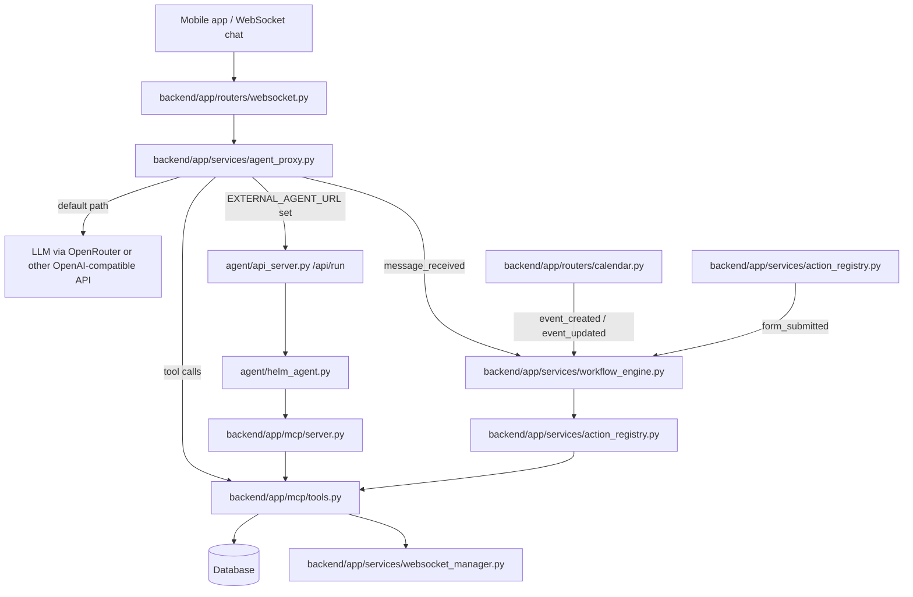

# Agents, MCP, Workflows, Triggers & Related Systems

> Last updated: 2026-06-18 (backend-style refresh: folder map up front, current counts, clearer reading order, and simpler legacy-vs-preferred notes)

## Tier 1: TL;DR

Think of Helm's agent stack as a shared tool layer with four pieces: the in-app proxy handles mobile chat, the MCP server exposes the same tools to outside agents, the workflow engine automates event-driven work, and the standalone agent runs as a separate process when you want an external assistant.

1. **In-app AI agent proxy** (`backend/app/services/agent_proxy.py`) — the chat path used by the mobile app. It saves each user message, streams the answer from an LLM (large language model), can call tools during the response, and fires workflow triggers. If `EXTERNAL_AGENT_URL` is set, it forwards the chat to the standalone agent instead of calling the LLM directly.
2. **MCP server** (`backend/app/mcp/`) — the Model Context Protocol (MCP) server mounted at `/mcp`. It exposes Helm tools to external agents and uses the same shared tool implementation layer as the in-app proxy.
3. **Workflow engine** (`backend/app/services/workflow_engine.py`) — the older React Flow workflow runner. It starts scheduled workflows with APScheduler and also reacts to events such as chat messages, calendar changes, and form submissions.
4. **Standalone agent** (`agent/`) — a separate process that runs outside the backend. It talks to Helm through MCP over HTTP and can also edit the React Native source tree with local tools limited to `mobile/`.

Shared rule: the real tool logic lives in `backend/app/mcp/tools.py`. Both the in-app proxy and the MCP server use it, so the behavior stays consistent.

## What to read first

If you want the shortest path through the docs, read them in this order:

1. `docs/codebase-explanation/backend.md` — backend wiring, services, routers, and mounted sub-apps
2. `docs/codebase-explanation/protocol.md` — WebSocket and MCP message shapes
3. This file — how the agent proxy, MCP server, workflow engine, and standalone agent fit together
4. `agent/helm_agent.py` and `agent/api_server.py` — if you want to run the standalone agent yourself

## Current counts

- **39 MCP tools** are registered in `backend/app/mcp/server.py`
- **5 files** live in `agent/`
- **2 automation models** back the two automation systems: `Workflow` and `TriggerDefinition`

## Legacy vs preferred

This codebase still has some older paths because the newer systems were added gradually. When both exist, prefer the current path below.

| Legacy or older path | Preferred or current path | Why |
|---|---|---|
| `update_module_state(module_type, state)` | `set_screen(module_id, screen)` | `set_screen` stores the row-first SDUI contract and draft flow. |
| `approve_draft` / `reject_draft` as the main publish path | `create_checkpoint` → `publish_version` | FF4 versioning is the current publish flow for new screens. |
| Schedule handling in the trigger system | Schedule handling in the workflow engine | Cron jobs belong in one place. |
| Manual reasoning about tool behavior from docs alone | `backend/app/mcp/server.py` and `backend/app/mcp/tools.py` | Those files are the current source of truth for the tool layer. |

## Folder map

### Backend control plane

| Path | What it owns | Notes |
|---|---|---|
| `backend/app/main.py` | App startup, middleware order, router registration, lifespan hooks, mounted sub-apps | This is the best place to start when you want to see how the backend boots. |
| `backend/app/routers/websocket.py` | WebSocket entry point for chat and module actions | Hands chat messages to the agent proxy. |
| `backend/app/services/agent_proxy.py` | In-app chat orchestration | Saves messages, streams model output, routes to external agent when configured, fires workflow triggers. |
| `backend/app/mcp/server.py` | MCP auth and tool registration | Current count: 39 tools. Mounted at `/mcp`. |
| `backend/app/mcp/tools.py` | Shared tool implementations | Single source of truth for external agents and the in-app proxy. |
| `backend/app/services/workflow_engine.py` | Scheduled workflow runner and graph executor | Uses APScheduler and React Flow graphs. |
| `backend/app/services/trigger_engine.py` | Newer trigger-definition runner | Handles JSON action chains for data-change and server-event style triggers. |
| `backend/app/services/action_registry.py` | Action dispatch layer | Reuses backend behavior for workflows, triggers, and other automation entry points. |
| `backend/app/services/websocket_manager.py` | Live connection fan-out | Broadcasts chat tokens, SDUI updates, notifications, and action results. |
| `backend/app/routers/calendar.py` | Calendar CRUD and calendar-side trigger hooks | Emits workflow events when events change. |
| `backend/app/routers/actions.py` | Action endpoints | Used by automation and form submission flows. |
| `backend/app/routers/workflows.py` | Workflow CRUD and import/export | Owns the older workflow editor surface. |
| `backend/app/routers/triggers.py` | Trigger CRUD and manual execution | Owns the newer trigger-definition surface. |
| `backend/app/models/workflow.py` | Workflow persistence | Stores the React Flow graph and schedule/event metadata. |
| `backend/app/models/trigger.py` | Trigger-definition persistence | Stores JSON config and action chains. |

### Standalone agent process

| Path | What it owns | Notes |
|---|---|---|
| `agent/helm_agent.py` | Main standalone-agent entry point | Runs in web, REPL, or one-shot mode. Builds the agent and connects to Helm's MCP server. |
| `agent/api_server.py` | HTTP wrapper around the agent | Serves the browser UI, exposes `/api/run`, and supports backend forwarding. |
| `agent/chat_ui.html` | Browser UI shell | Shared by the standalone agent's web mode and the HTTP wrapper. |
| `agent/send_prompt.py` | Convenience one-shot client | Sends a single prompt to a running `api_server.py` instance. |
| `agent/README.md` | Local runbook | Setup notes live here, but prefer `helm_agent.py` and `api_server.py` for current runtime behavior. |

## Architecture flow

### How the flow works

1. The mobile app sends a `chat_message` over the WebSocket.
2. `backend/app/routers/websocket.py` passes it to `handle_chat_message()` in `agent_proxy.py`.
3. The proxy saves the user message first, then fires the `message_received` workflow trigger.
4. If `EXTERNAL_AGENT_URL` is set, the proxy forwards the message to `agent/api_server.py` with SSE (server-sent events) at `/api/run`.
5. If `EXTERNAL_AGENT_URL` is not set, the proxy talks to the configured LLM directly and streams the response back to the app.
6. When the model asks for a tool, the proxy dispatches it through `backend/app/mcp/tools.py`.
7. Workflow and trigger systems reuse the same backend actions and tool implementations instead of duplicating behavior.
8. The standalone agent reaches Helm over HTTP through the MCP server and can also edit `mobile/` files with its local filesystem tools.

## In-app AI agent proxy

### What it is

The agent proxy is not a separate service. It lives inside the backend and handles the chat path used by the mobile app.

### Where it lives

- `backend/app/services/agent_proxy.py`
- called from `backend/app/routers/websocket.py`
- shares live updates through `backend/app/services/websocket_manager.py`

### What it does

1. Stores the user message before doing anything else.
2. Fires the `message_received` workflow trigger.
3. Chooses one of two paths:
   - **Default path**: call the configured LLM directly
   - **External path**: forward to `EXTERNAL_AGENT_URL` and stream the response back
4. Streams response tokens back to the frontend as they arrive.
5. Executes tool calls through `backend/app/mcp/tools.py`.

### Why it exists

It keeps the mobile app chat simple. The app only has to send one WebSocket message. The backend decides whether the answer comes from the built-in model or from a separate agent process.

### Main WebSocket events

| Event | Meaning |
|---|---|
| `chat_start` | Assistant response has started |
| `chat_token` | A streamed text chunk arrived |
| `tool_result` | A tool finished successfully |
| `tool_error` | A tool failed |
| `chat_message_replace` | The proxy cleaned up model output, such as XML tool-call wrappers |
| `chat_complete` | The final message was saved and sent |
| `chat_error` | Something went wrong |

### Tool-call fallback

Some models do not emit native function calls. For those cases, the proxy can parse XML-style tool-call blocks from the model output, strip them from the visible message, and then run the tool request normally.

## MCP server

### What it is

MCP stands for **Model Context Protocol**. The MCP server is the network-facing tool server that external agents connect to.

### Where it lives

- `backend/app/mcp/server.py` — auth, tool registration, and the FastMCP wrapper
- `backend/app/mcp/tools.py` — the actual tool implementations
- mounted at `/mcp` by `backend/app/main.py`

### How it works

1. An external agent sends an HTTP request with `Authorization: Bearer <token>`.
2. The MCP middleware validates the session token and resolves the current user.
3. `FastMCP("Helm")` exposes the tool registry.
4. Every tool call is routed to `backend/app/mcp/tools.py`.
5. Tool code updates the database and broadcasts WebSocket events when needed.

### What the MCP server exposes

The current tool set covers these families:

- calendar read/write
- notifications
- chat history and assistant message sending
- SDUI screen read/write/delete/list and draft/version flows
- tab visibility and renaming
- apps, modules, templates, and preview sessions
- user and device-facing utility actions

The exact tool list lives in `backend/app/mcp/server.py`. Trust that file when the count changes.

### Why it exists

Some agents live outside the backend process. They still need the same Helm actions that the in-app proxy uses, but they need them over a stable network protocol. MCP provides that bridge.

## Workflow engine

### What it is

The workflow engine is the backend scheduler and graph runner. It is the older automation system and is still active.

### Where it lives

- `backend/app/services/workflow_engine.py`
- `backend/app/models/workflow.py`
- `backend/app/routers/workflows.py`
- event sources live in routers and services such as `calendar.py`, `websocket.py`, and `action_registry.py`

### How it works

- Uses APScheduler with `AsyncIOScheduler(timezone="UTC")`
- Starts during backend lifespan startup
- Rebuilds scheduled jobs from the database when the backend comes up
- Stores workflows as React Flow graphs: nodes + edges
- Executes node types such as `action`, `condition`, `switch`, and `loop`
- Sends action work through the shared backend action layer

### Trigger sources it listens to

| Trigger source | Where it comes from |
|---|---|
| `onSchedule` workflows | APScheduler cron jobs |
| `message_received` | `agent_proxy.py` after a chat message is saved |
| `event_created` / `event_updated` | Calendar router changes |
| `form_submitted` | Form/action handling in the backend |

### Workflow engine vs trigger engine

These are related, but they are not the same system.

| System | Best for | Main files | Notes |
|---|---|---|---|
| Workflow engine | Cron schedules and React Flow graphs | `workflow_engine.py`, `workflow.py` | This is the older system and still handles schedules. |
| Trigger engine | Data-change and server-event style JSON action chains | `trigger_engine.py`, `trigger.py` | This is newer and narrower. Use it for trigger-definition flows, not cron jobs. |

### Why this split matters

When you see a scheduled workflow, look in `workflow_engine.py`. When you see a newer trigger definition with JSON action chains, look in `trigger_engine.py`. That keeps cron logic out of the newer trigger path and makes the code easier to follow.

## Standalone agent

### What it is

The standalone agent is a separate process. It does not import backend Python modules. It talks to Helm over HTTP and uses its own local file tools for `mobile/`.

### Where it lives

- `agent/helm_agent.py` — main entry point
- `agent/api_server.py` — HTTP service for browser chat and backend forwarding
- `agent/chat_ui.html` — local browser UI shell
- `agent/send_prompt.py` — one-shot client

### How it connects to Helm

1. It opens an MCP connection to `backend/app/mcp/server.py` over HTTP.
2. It authenticates with a Helm session token.
3. It calls the same Helm tool layer the backend uses.
4. When the backend is configured with `EXTERNAL_AGENT_URL`, the backend can forward mobile chat to `agent/api_server.py` at `/api/run`.

### Local file tools

The standalone agent can also read and write files in `mobile/`, but only through a small, folder-limited tool set:

- `read_frontend_file(relative_path)`
- `write_frontend_file(relative_path, content)`
- `list_frontend_files(subdirectory="")`

Those tools are intentionally narrow. They are there so the agent can help with the React Native app without getting access to the rest of the repository.

### Run modes

- `python helm_agent.py --web` — browser UI
- `python helm_agent.py` — interactive REPL
- `python helm_agent.py "task"` — one-shot run
- `python api_server.py` — standalone HTTP service used by the backend and browser UI

## Short mental model

If you only remember one thing, remember this:

- The **mobile app** talks to the **backend proxy**.
- The **backend proxy** either talks to an LLM or forwards to the **standalone agent**.
- The **MCP server** exposes the backend's tools to outside agents.
- The **workflow engine** and **trigger engine** automate background behavior.
- The **shared tool layer** keeps the behavior consistent across all of those paths.
